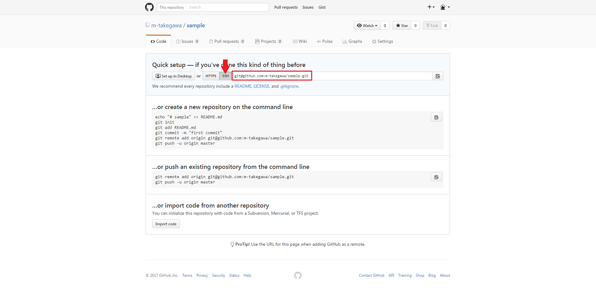
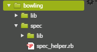

## 2.4 Rubyによるボウリングプログラム

### 2.4.1 事前準備
 - リポジトリの作成  
    まずはGitを利用するために、リポジトリを作成しましょう。  
    今回は、GitHub上でリポジトリを作成しておいて、それをローカルにクローン（複製）する形式で行います。   
    GitHub上にリポジトリを作成する手順は以下の通りです。  

    1. 右上の＋メニュー等から、「New repository」を選択する
    2. 「Repository name」の項目に、"bowling"と入力して「Create repository」ボタンを押す
    3. リポジトリのトップページに遷移する
    <br>
    <br>

    作成自体はこれで完了です。  
    次に、実際に作業をする場所を作成していきましょう。  
    <br>

 - ssh-keyの登録<br>
  作成したリポジトリをクローンするには、ssh-keyを発行してGithubに登録する必要があります。
  以下の手順で登録をしてください。

    【ssh-keyの登録】<br>
    まずは、ssh-keyを入れる階層へ移動し、ssh-keyを作成します。
    ```sh
    $ cd ~/.ssh
    $ ssh-keygen -t rsa
    ```
    下記のようにメッセージが出てきますが、それぞれキーの名前（ここではbowlingとする）、キーのパスワードを確認含めて２回入力する。
    ```sh
    Generating public/private rsa key pair.
    Enter file in which to save the key (/Users/(username)/.ssh/id_rsa):
    Enter passphrase (empty for no passphrase):
    Enter same passphrase again:
    ```

    【公開鍵をGithubに登録する】  
      以下の手順で登録をしておくことで、ssh-keyの利用をすることが出来ます。  

      1. 公開鍵の名前をbowlingとした場合、下記コマンドで鍵の内容を表示する。

          ```sh
          $ cat ~/.ssh/bowling.pub
          ```
      2. "ssh-rsa"から始まる枠内の文字列をコピーする
      3. GitHub側の「Settings」メニュー内で「SSH and GPG keys」を選択する
      4. 「New SSH key」ボタンを押して、「Title」に"Cloud9"（目的や用途が分かる名前）、
         「Key」にコピーした文字列をそのまま貼り付ける
      5. 「Add SSH key」ボタンを押してssh-keyを登録する<br><br>

    【GitをCloneする】<br>
      ローカルにリポジトリを格納するフォルダ（ワークスペース）を作成しましょう。
      ```sh
      $ mkdir /home/ユーザー名/ruby
      $ cd /home/ユーザー名/ruby
      ```

      作成したリポジトリをローカルにクローンします。
      ユーザー名をXXX、リポジトリ名をbowlingとした場合、下記の入力を行います。
      ```sh
      $ git clone git@github.com:XXX/bowling.git
      ```
    　クローンが完了したらリポジトリの中に入りましょう。
      ```sh
      $ cd bowling
      ```


    リポジトリのURLは、作成したリポジトリのトップページから確認することが出来ます。

      
  
    ワークスペースが作成出来たら、masterブランチをリモートにも作成するために`first commit`をしましょう。  

    readme.mdファイルを新規作成して、以下のコマンドを実行してみてください。  

    ```sh
    $ git add readme.md
    $ git commit -m "first commit"
    ```

    `git add <ファイル名>`でステージングエリア（インデックス）に一時保存して、  
    `git commit`で変更の履歴を付けます。

    最後に以下のコマンドを実行すると、リモートに変更が反映されて、masterブランチが作成されます。  

    ```sh
    $ git push
    ```

    以降はこのmasterブランチを基にして、作業内容毎にブランチを切って進めていきます。 

 - 作業ブランチの作成  
    最初は、ボウリングプログラムの基礎となるスコアの合計機能を追加するブランチを、  
    以下のコマンドを使用して作成します。  

    ```sh
    $ git branch calc_total_score
    $ git checkout calc_total_score
    ```

    また、以下のように１つのコマンドにまとめることも出来ます。  

    ```sh
    $ git checkout -b calc_total_score
    ```

    <br>

 - RSpecの導入  
    以前に述べた通り、今回テストツールはRSpecを使用します。  
    ただし、RSpecは標準では搭載されていないため、インストール作業が必要です。  

    【インストール】  
    インストールには以下のコマンドを使用します。  

    ```sh
    $ gem install rspec
    ```

    上記のコマンドを実行して、成功のメッセージが出ればインストールは完了です。  

    【初期設定】  
    次に初期設定を行います。  
    初期設定は以下のコマンドを使用します。  

    ```sh
    $ rspec --init
    ```

    実行後に自動で`spec`フォルダと`spec_helper.rb`というファイルが生成されていればOKです。  

    また、表示上では見えませんが、`.rspec`という隠しファイルも生成されているはずです。  
    このファイルではRSpecの設定をすることが出来ます。  
    試しにvimやnanoでこの隠しファイルを開いて、以下の内容を書き込んでみてください。  

    ```
    --format documentation
    ```
    これは後で確認しますが、テストの実行結果の出力を見やすくする設定です。  
    <br>

 - フォルダ構成の整理  
    RSpecの導入段階でspecフォルダが出来たので、ついでにフォルダ構成も整えておきましょう。  
    bowlingフォルダとspecフォルダの直下にそれぞれ`lib`フォルダを作成してください。  
    以下のような構成になっていればOKです。  

    

    `/lib`フォルダには実際のプログラムコードを、`/spec/lib`フォルダにはテストコードをそれぞれ書いていきます。  
    <br>

それでは一通り準備が出来たので、次からボウリングプログラムの基礎となる部分を実際に作っていきましょう。

### 2.4.2　ボウリングプログラムの基礎部分を作成
#### 2.4.2-1 流れのおさらい  
ボウリングプログラムを作成するにあたって、その流れを改めておさらいしておきましょう。  
今回は、Rubyでのプログラミングに加え、GitHub FlowとTDD(Test-Driven Development)を採用しています。  

GitHub Flowは、GitHubを使ったソフトウェア開発の手法の一つで、以下のような流れで開発を進めます。

  1. ブランチの作成：新機能の追加やバグ修正などの作業ごとに、masterブランチから新しいブランチを作成します。
  2. コードの変更とコミット：作成したブランチでコードを変更し、その変更をコミットします。
  3. プッシュとプルリクエスト: 変更をリモートリポジトリにプッシュし、GitHub上でプルリクエスト(Pull Request)を作成します。プルリクエストには、コードの変更内容や意図が記述されます。
  4. レビューとディスカッション：プルリクエストをチームメンバーや関係者にレビューしてもらいます。レビュアーはコードの変更を確認し、必要に応じてコメントや修正リクエストを行います。
  5. マージ：レビューが完了し、プルリクエストが承認されたら、masterブランチに変更をマージします。これにより、新機能や修正が本番環境に反映されます。

このGitHub FlowとTDDの要素を組み合わせると実際に行う作業は以下のようになります。  

  1. masterから作業用ブランチを作成する
  2. ブランチ内でTDDを用いたプログラミングを行う  
      1. テストコードを書く(まだコードが書かれていないのでこの時点では失敗する)  
      2. テストが成功するようにプログラムコードを書く  
      3. コードをリファクタリングする  
  3. 機能が出来たらリモートにプッシュする
  4. PRを作成してレビューをする
  5. OKならmasterにマージする

作業用ブランチは先程作成したので、プログラミングに入っていきます。  
<br>

その前にボウリングのルールについて簡単に説明しておきます。  
1. フレーム:
    - ボウリングは10フレームで行われます。
    - 各フレームでは最大2回の投球がありますが、スペアまたはストライクを出した場合はボーナス投球が与えられることがあります。
2. スコア計算:
    - ピンを全て倒すことを「ストライク」と呼び、最初の投球で全てのピンを倒した場合、次の2投分の得点が加算されます。
    - 2投目で残ったピンを全て倒すことを「スペア」と呼び、次の1投分の得点が加算されます。
    - どちらもない場合、倒したピンの数がそのフレームの得点となります。
    - 最終フレームでは、ストライクまたはスペアを出した場合、ボーナス投球が与えられます。
3. ガター:
    - ピンを倒さずに全ての投球が終了することを「ガター」と呼びます。得点には加算されません。
4. 最終フレーム:
    - 10フレーム目では、追加のボーナス投球が与えられます。これにより、ストライクまたはスペアを出した場合にボーナススコアが加算されます。
5. 最終的なスコア:
    - 最終的なスコアは、10フレーム全ての得点を合計したものです。

#### 2.4.2-2　__「テストコードを書く」__  
まずは最低限のファイルを作成しましょう。  
`/lib`の直下に、プログラムコード用の`bowling.rb`ファイルを作成し、  
`/spec/lib`の直下に、テストコード用の`bowling_spec.rb`ファイルを作成してください。  

`bowling.rb`には、ボウリング用の空っぽのクラスを作成しておきます。    

```rb
# bowling.rb

# ボウリングのスコアを管理するクラス
class Bowling
end
```

では実際に、`bowling_spec.rb`へテストコードを書いてみましょう。  
スコアの合計を求めるならば、１投ごとの得点を足していけば合計が出せそうな気がします。  
そのためには、得点を足すメソッドと合計を返すメソッドの２つが必要になりそうです。  
仮にそういうものがあったなら、という想定でテストコードを書くと、以下のような形になります。  

```rb
# bowling_spec.rb

require "bowling"

describe "ボウリングのスコア計算" do
  describe "全体の合計" do
    context "全ての投球がガターだった場合" do
      it "0になること" do
        @game = Bowling.new

        20.times do
          @game.add_score(0)
        end

        expect(@game.total_score).to eq 0
      end
    end

    context "全ての投球で1ピンずつ倒した場合" do
      it "20になること" do
        @game = Bowling.new

        20.times do
          @game.add_score(1)
        end

        expect(@game.total_score).to eq 20
      end
    end
  end
end
```

そのままテストを実行してみましょう。  
テストを実行する際には以下のコマンドを使用します。  

```sh
$ rspec spec/lib/bowling_spec.rb
```

勿論、テストコードにあるようなメソッドはまだ実装していないので失敗するはずです。  
テストコードを実行して失敗すればOKです。

失敗することが確認出来たら、ここで一旦コミットしておきましょう。  
GitHub Flowの原則として、ローカルでのコミットはなるべく細かい単位でやるべきだと言われていますので、  
それに則って進めていきましょう。  
`Rubyによるボウリングプログラム`の章では以降コミットするべき段階になったら、*commit* と記述しますので、その段階でコミットしていってください。  

では早速、このテストが成功するようにしてみましょう。  
<br>

#### 2.4.2-3　__「テストが成功するようにプログラムコードを書く」__  
今度はプログラムコードの方を触っていきます。  
先程テストコードでメソッドを２つ定義したので、それに合わせて実際のプログラムコードを組んでみましょう。  
それぞれの役割を考えると、プログラムコードは以下のようになります。  


```rb
# bowling.rb

# ボウリングのスコアを管理するクラス
class Bowling
  # インスタンスを生成する時に処理が実行される
  def initialize
    # スコアの合計
    @total_score = 0
  end

  # スコアの合計を返す
  def total_score
    @total_score
  end

  # スコアを追加する
  def add_score(pins)
    @total_score += pins
  end
end
```

以上のプログラムコードを踏まえて、改めてテストを実行してみましょう。  
今度はテストが成功していると思います。  

*commit*

次に作成したコードをリファクタリングしてみましょう。  
<br>

#### 2.4.2-4　__「コードをリファクタリングする」__  
プログラミングの最後は、コードをリファクタリングします。  
今のままでもプログラムは動いていますが、プログラムの保守性や他の人が読んだ時の可読性も重要です。  
それらを高めるために、重複している部分を無くしたり、冗長になってしまったコードを簡略化していきます。  

とはいえ、プログラムコードの方は特に直す部分が無いように見えます。  
ですが、テストコードの方には同じようなコードが何度も登場しているので、これをリファクタリングしてみましょう。  

リファクタリングした後のテストコードは以下のようになります。  


```rb
# bowling_spec.rb

require "bowling"

describe "ボウリングのスコア計算" do
  # インスタンスの生成を共通化
  before do
    @game = Bowling.new
  end

  describe "全体の合計" do
    context "全ての投球がガターだった場合" do
      it "0になること" do
        add_many_scores(20, 0)
        expect(@game.total_score).to eq 0
      end
    end

    context "全ての投球で1ピンずつ倒した場合" do
      it "20になること" do
        add_many_scores(20, 1)
        expect(@game.total_score).to eq 20
      end
    end
  end
end

private
# 複数回のスコア追加をまとめて実行する
def add_many_scores(count, pins)
  count.times do
    @game.add_score(pins)
  end
end
```

コードの修正が出来たら、改めてテストを実行してみましょう。  
ここで成功していればOKです。  

*commit*

ここまで出来ればこのブランチでやりたいことは完了です。  
後はこのプログラムをリモートに反映させていきましょう。  
<br>

#### 2.4.2-5　__「機能が出来たらリモートにプッシュする」__  
リモートにローカルの変更を反映させるのは、`git push`というコマンドです。  
masterブランチで使用した際には、本来記述するべき部分が自動で補完されているのでコマンドの名前だけでしたが、
今回は新規でブランチを作成しているので、ブランチの指定をしてプッシュしましょう。  

```sh
$ git push origin calc_total_score
```

以上のコマンドを実行すると、GitHub上にも`calc_total_score`ブランチが作成されているはずです。  

次はそのブランチを使って、Pull Requestを作成してみましょう。  
<br>

#### 2.4.2-6　__「PRを作成してレビューをする」__  
PRを作成するのはGitHub上の操作になります。  
手順は以下の通りです。  

1. Pull Requestsタブを選択して、右上の「New pull request」ボタンを押す
2. 「base」に"master"、「compare」に"calc_total_score"を選択する
3. 表示された変更で間違いなければ、「Create pull request」ボタンを押す
4. PRの名前や説明文を編集して、もう一度「Create pull request」ボタンを押す

これでPRが作成されているはずです。  
Pull Requestsタブを選択すると、作成されたPRが一覧で表示されています。  
他の人にレビューをしてもらう場合には、このPRを基にレビューやフィードバックからの修正を行います。  

差分などを確認して、問題なければmasterブランチにマージする作業に移ります。  
<br>

#### 2.4.2-7　__「OKならmasterにマージする」__  
レビューでOKが出れば、それをmasterブランチに取り込みます。（マージ）  
マージする方法はいくつかありますが、今回はGitHub上でマージする方法を使ってみます。  

とは言っても、GitHub上でマージする場合はボタン一つで片が付きます。  
PRのページに行くと、「Merge pull request」というボタンがあります。  
このボタンを押すと、PRを作成した際に選択した「base」（マージ先）と  
「compare」（マージ対象）のブランチでマージが行われます。  

無事マージが完了すれば、リモートのmasterブランチが最新の状態になっているはずです。  

ここまでが、機能を実装する一連の流れになります。  
これを繰り返していくことで、ボウリングプログラムの機能を追加していきます。  

それでは続いて、次の章からは少し難しい機能を実装していきましょう。  
