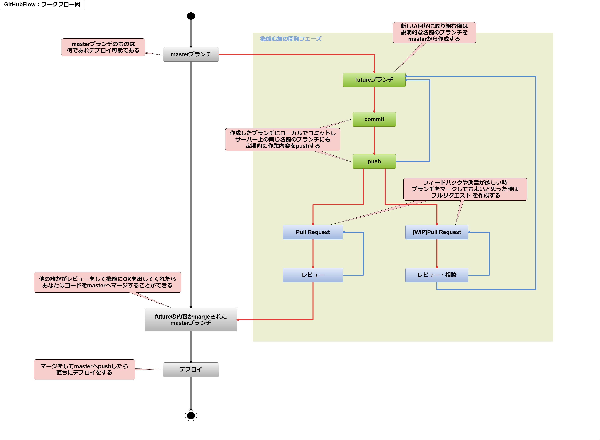

## 3.4 Git基礎2

### 3.4.1 ワーキングディレクトリと作業ブランチについて

- 作業ブランチの作成  

  以前作成したFizzBuzzプログラムの内容を追加するためのブランチを作成してみましょう。  
  ブランチの作成と作業ブランチの切り替え（ワーキングディレクトリへの移動）は、以下のコマンドを使用して行います。  

  ```sh
  $ git branch call_fizzbuzz
  $ git checkout call_fizzbuzz
  ```

  上記のコマンドは、`git branch`コマンドでブランチを作成し`git checkout`コマンドで作業ブランチを切り替えています

  また、以下のように１つのコマンドにまとめることも出来ます。  

  ```sh
  $ git checkout -b call_fizzbuzz
  ```

ブランチの切り替え自体は以前同様に`git checkout`でも可能ですが、Gitのバージョン2.23以降ではブランチの切り替えに特化した`git switch`が追加されました。  
`git checkout`にはブランチの切り替え以外にも作業ディレクトリの取り消しなど様々な機能が備わっています。そのため、使用方法がややこしかったり、誤った操作を行いやすいといった問題がありました。  
そこで、ブランチの切り替えに特化した`git switch`が導入されました。以前同様に`git checkout`の機能は残っていますが、`git switch`が導入されたことによって役割が明確に分かれ、使いやすくなりました。  

Gitのバージョンが2.23移行であれば、下記のコマンドが実行できます。

```sh
$ git switch branch_name
```

またブランチの作成は`-c`もしくは`--create`オプションを追加することで実行できます。

```sh
$ git switch -c new_branch
```

- ブランチの一覧表示  

  `git branch`コマンドの引数を指定せずに実行すると、ブランチの一覧を表示することができます。現在のブランチは頭に * がついています。

  ```sh
  $ git branch
    * call_fizzbuzz
    master
  ```

- 問題：作業ブランチに変更内容をコミットする

  それでは、以前作成したFizzBuzzプログラムの内容を変更内容として追加しましょう。  
  前のコマを参考にしながら、コミットしてみてください。


### 3.4.2 作業のやりなおしについて

開発作業中に何かをやり直したくなる場面はよくあります。ここでは、行った変更を取り消すための基本的なコマンドについて説明します。  


- ローカルリポジトリの作業ブランチへの変更を取り消す

  ```sh
  $ git checkout .
  ```

  `git checkout <ファイル名>`とすると変更の取り消しを行いたいファイルのみ取り消す事ができます。  
  `git checkout .`の場合は、作業ブランチで変更した内容をすべて取り消してはくれますが、新規追加したファイルは削除されません。  
  完全にもとに戻したい場合は別途削除する必要があります。

  ```sh
  $ git clean -df .
  ``` 

- addの取り消し

  ```sh
  $ git reset HEAD .
  ```

- commitの取り消し

  ```sh
  $ git reset [<mode>] [<commit>] .
  ```
  
  `mode`のデフォルトは`--mixed`なので、変更したファイルはすべて変わらず、gitの履歴のみ変更されます。  
  変更したファイルも含めてすべて指定したのcommitの状態に戻したいので場合には`mode`に`--hard`を指定して下さい。
  新規追加したファイルは`--hard`を指定したとしても削除されず、残ったままになるため 完全に元に戻したいのであれば別途削除する必要があります。


- リモートリポジトリにpushした内容を取り消す

  ```sh
  $ git revert [<commit>]
  $ git push
  ```


### 3.4.3 GitHub Flowとは

#### 概要

  `GitHub Flow`は、GitとGitHubを利用したワークフローで、とてもシンプルな構造であるにも関わらず、生産性を大きく向上させる効果を持っています。  
  コマンドライン上の操作だけではなく、GUIを用いた仕組みを取り入れることで、Gitに慣れていない人でも比較的ハードルの低いワークフローになっています。    

#### 基本原則

  - masterブランチのものは何であれデプロイ可能である
  - 新しい何かに取り組む際は、説明的な名前のブランチをmainから作成する（例: new-oauth2-scopes）
  - 作成したブランチにローカルでコミットし、サーバー上の同じ名前のブランチにも定期的に作業内容をpushする
  - フィードバックや助言が欲しい時、ブランチをマージしてもよいと思ったときは、 プルリクエスト を作成する
  - 他の誰かがレビューをして機能にOKを出してくれたら、あなたはコードをmainへマージすることができる
  - マージをしてmainへpushしたら、直ちにデプロイをする

#### 実際のワークフロー

  最初にもある通り、このワークフローはとてもシンプルな構造になっています。  
  具体的には、基本原則を一通りなぞっていけば、それがこのワークフローの全てだと言える程です。  
  以下がワークフローの詳細です。



この教材での開発はこのワークフローを使用して進めていくことになります。