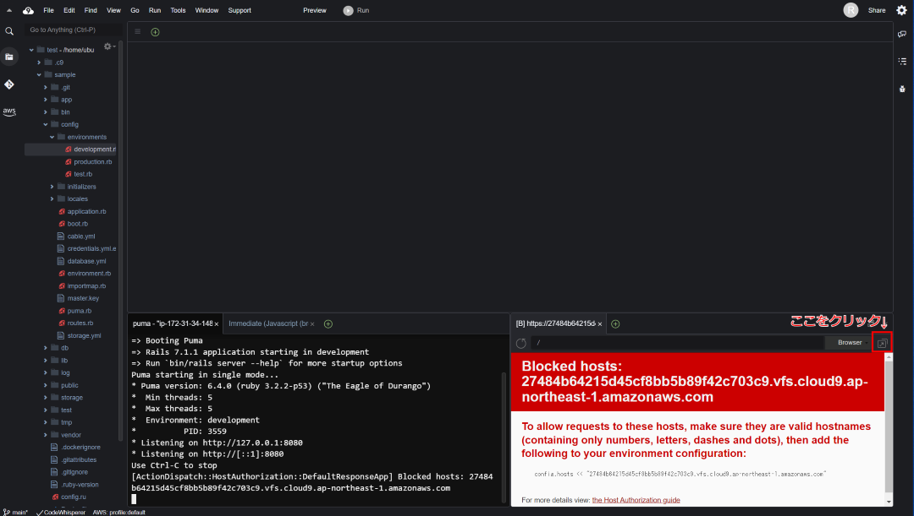
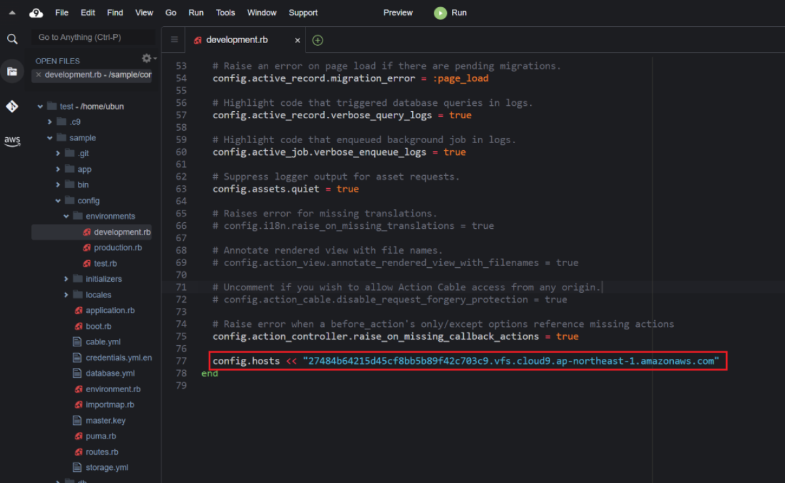

## 3.1 Ruby on Rails：開発環境の構築

ここでは、Ruby on Railsの開発環境を構築する手順を説明します。

Ruby on Railsは、その名前にあるようにRubyやRailsが必要です。また、そのRubyやRailsの動作に必要な環境やソフトウェアのインストールも必要です。

環境構築は、オペレーティングシステム(OS)によって、インストールの手順が異なります。今回は以下の項目の説明をします。

 1. [Windows 用セットアップ(WSLが利用できるWindows 10 64bit)](#win10)
 2. [Linux 用セットアップ(Ubuntu 22.04 LTS)](#linux)
 3. [仮想環境(VirtualBox)](#vbox)
 4. [クラウドサービス(AWS Cloud9)](#cloud9)

どのオペレーティングシステムを利用する場合でも、インターネットへ接続が必要です。その際、インストール手順によっては、ギガバイト単位でファイルをダウンロードすることもありますので、ご注意ください。

ダウンロードするファイルは、一般的にセキュリティの問題やバグで修正があればバージョン番号が上がります。以下の手順に示されているファイルのバージョンと比べて、メンテナンスバージョン(たとえば、v1.2.3でいうと3のところ)が大きくなっていることがあります。その場合は、新しいものをダウンロードしてください。

また、メジャーバージョン(たとえば、v1.2.3でいうところの1のところ)やマイナーバージョンが異なる場合は、機能の追加や廃止等の理由から期待している動作をしない可能性もありますので、ご注意ください。

<a id="win10"></a>
### 3.1.1 Windows 用セットアップ(WSLが利用できるWindows 10 64bit)

Windows 10で利用できる、WSLとUbuntuのアプリで環境を構築します。

以下の手順では、Windowsの管理者のパスワードが必要です。

 1. Windows Subsystem for Linuxをインストールします
 
    画面左下の`スタート`アイコンをクリックします。

    歯車の`設定`アイコンをクリックします。

    `アプリ`をクリックします。

    `プログラムと機能`をクリックします。

    `Windowsの機能の有効化または無効化`をクリックします

    パスワードの入力を求められたら管理者のアカウント名を確認して、パスワードを入力します

    `Windowsの機能`ダイアログが表示されるので、`Windows Subsystem for Linux(Linux 用 Windows サブシステム)`をチェックします

    `OK`ボタンをクリックします

    インストールにしばらく時間がかかります。

    再起動が必要であれば再起動します。

 2. Microsoft StoreからUbuntuをインストールします
 
    画面左下の`スタート`アイコンをクリックします。

    `Microsoft Store`をクリックします

    ルーペの`検索`アイコンをクリックします

    キーワードを入力する枠にubuntuと入力して検索します

    `Ubuntu 22.04`と表示のあるアプリをクリックします

    `入手`ボタンをクリックします

    `複数のデバイスで使用する`と確認される場合がありますが、ここでは`必要ありません`をクリックします。

    インストールにしばらく時間がかかります。

    `起動`ボタンをクリックします

    準備にしばらく時間がかかります。
    ```sh
    Enter new UNIX username:
    ```
    と表示されたら、任意のユーザー名を入力します。
    ```sh
    Enter new UNIX password:
    ```
    と表示されたら、任意のパスワードを入力します。
    
    今使っているWindowsアカウントのパスワードや管理者のパスワードではありません。
    ```sh
    Tetype new UNIX password:
    ```
    と表示されたら、同じパスワードを入力します。

    ２つのパスワードが一致すると
    ```sh
    xxxx@yyyy: $
    ```
    と表示されます。xxxxには、先ほどのユーザー名、yyyyはWindowsのコンピュータ名が表示されます。

    ユーザー名と、パスワードは忘れないようにしましょう。

    念のため、日本時間に合わせます
    ```sh
    sudo dpkg-reconfigure tzdata
    ```
    (補足)

    もし、コマンドをテキストから貼り付ける場合は、マウスの右ボタン(右利きの場合)をクリックすると貼り付けることができます。

    パスワードには、UNIX(WSL)のパスワードを入力します。

    AsiaとTokyoを選択します。ただし`OK`を選択するためにはマウスは使えないので、`TAB`キーを数回押して移動して選択してください。
    ```sh
    date
    ```
    と入力して、Asia/Tokyoと表示されれば設定できています。

 3. UNIX(WSL)環境を最新化します

    ```sh
    sudo apt update
    sudo apt upgrade -y
    sudo apt install autoconf bison build-essential libyaml-dev libreadline-dev zlib1g-dev libncurses5-dev libffi-dev libgdbm-dev sqlite3 libsqlite3-dev node-gyp npm -y 
    ```

 4. Rubyのバージョン管理システムのrbenvをインストールします

    ```sh
    git clone https://github.com/rbenv/rbenv.git ~/.rbenv
    echo 'export PATH="$HOME/.rbenv/bin:$PATH"' >> ~/.bashrc
    echo 'eval "$(rbenv init -)"' >> ~/.bashrc
    source ~/.bashrc
    git clone https://github.com/rbenv/ruby-build.git "$(rbenv root)"/plugins/ruby-build
    ```

 5. rbenvを使ってRubyをインストールします

    ```sh
    rbenv install 3.2.4
    ```

 6. 手順5でインストールしたRubyを常用のRubyとして設定します

    ```sh
    rbenv global 3.2.4
    ```

 7. Railsをインストールをします

    ```sh
    gem install rails -v 7.1.1 --no-document
    ```

 8. 動作確認をします

    ```sh
    rails new sample
    cd sample
    rails g scaffold book name:string
    rails db:migrate
    rails server
    ```
    ブラウザのURL欄に `http://localhost:3000/books` と入力して、画面が表示されれば成功です。


    動作が確認できたら、`CTRL`キーと`C`キーを同時に押して、Rails serverを停止しましょう。

    (補足)

    UNIX(WSL)環境で、
    ```sh
    explorer.exe .
    ```
    とすることで、作業しているディレクトリ(カレントディレクトリ)をWindowsのエクスプローラで参照できます。
    この場所をWindows上にインストールしたコードエディタで参照することでファイルを編集できます。

 9. コードエディタをインストールします。

    コードエディタの一例です。エディタはWindows用をダウンロードして、インストールします。
    すでにお気に入りのコードエディタをインストールされている場合は、それらをお使いください。
    - ATOM
    - Visual Studio Code
    - Sublime Text

<a id="linux"></a>
### 3.1.2 Linux 用セットアップ(Ubuntu)

 1. Rubyのインストールに必要なコマンド等をインストールします

    ```sh
    sudo apt update
    sudo apt upgrade -y
    sudo apt install git curl net-tools gcc make -y
    ```

 2. Ruby on Railsの環境に必要なライブラリ等をインストールします

    ```sh
    sudo apt install autoconf bison build-essential libyaml-dev libreadline-dev zlib1g-dev libncurses5-dev libffi-dev libgdbm-dev sqlite3 libsqlite3-dev -y
    ```

    ※VB環境でインストールするときに`rbenv install 3.2.4`がうまくできないときがあります。その時は下記のコマンドを入力してください。
    ```sh
    sudo apt-get install -y libssl-dev
    ```

 3. Rubyのバージョン管理システムのrbenvをインストールします

    ```sh
    git clone https://github.com/rbenv/rbenv.git ~/.rbenv
    echo 'export PATH="$HOME/.rbenv/bin:$PATH"' >> ~/.bashrc
    echo 'eval "$(rbenv init -)"' >> ~/.bashrc
    source ~/.bashrc
    git clone https://github.com/rbenv/ruby-build.git "$(rbenv root)"/plugins/ruby-build
    ```

 4. rbenvを使ってRubyをインストールします

    ```sh
    rbenv install 3.2.4
    ```

 5. 手順4でインストールしたRubyを常用のRubyとして設定します

    ```sh
    rbenv global 3.2.4
    ```

 <!-- bootstrapのインストール時などに確認する

6. Node.jsをインストールする為のnodenvをインストールします

    ```sh
    git clone https://github.com/nodenv/nodenv.git ~/.nodenv
    git clone https://github.com/nodenv/node-build.git ~/.nodenv/plugins/node-build
    echo 'export PATH="$HOME/.nodenv/bin:$PATH"' >> ~/.bashrc
    echo 'eval "$(nodenv init -)"' >> ~/.bashrc
    source ~/.bashrc
    ```

 7. nodenvを使ってNode.jsをインストールします

    ```sh
    nodenv install 16.14.0
    ```
 
 8. 手順7でインストールしたNode.jsを常用のnodeとして設定します 
 
     ```sh
    nodenv global 16.14.0
    ``` -->

 6. Railsをインストールをします

    ```sh
    gem install rails -v 7.1.1 -N
    ```


 <!-- bootstrapのインストール時などに確認する
 
  10. yarnをインストール

      ```sh
      curl -sS https://dl.yarnpkg.com/debian/pubkey.gpg | sudo apt-key add -
      echo "deb https://dl.yarnpkg.com/debian/ stable main" | sudo tee /etc/apt/sources.list.d/yarn.list
      sudo apt update
      sudo apt install yarn -y
      sudo apt remove nodejs -y
      sudo ln -s `which node` /usr/bin/node
      ```
    
   メモ:
   個々のユーザーディレクトリに存在するnodeコマンドを/usr/bin/nodeにリンクを張るのは筋が悪いのですが
   /usr/bin/nodeにコマンドがあることが期待されることがあるので暫定対応です。 -->


 7. 動作確認をします

      ```
      rails new sample
      cd sample
      rails g scaffold book name:string
      rails db:create
      rails db:migrate
      rails server
      ```
      ブラウザのURL欄に `http://localhost:3000/books` と入力して、画面が表示されれば成功です。

      動作が確認できたら、`CTRL`キーと`C`キーを同時に押して、Rails serverを停止しましょう。

 8. コードエディタをインストールします。

      コードエディタの一例です。
      すでにお気に入りのコードエディタをインストールされている場合は、それらをお使いください。
      - ATOM
      - Visual Studio Code
      - Sublime Text

<a id="vbox"></a>
### 3.1.3 仮想環境(VirtualBox)

コンピュータの中に、別のコンピュータの環境を構築できる仮想環境ソフトウェアとしてVirtualBoxやVMware、Hyper-V等がありますが、ここではVirtualBoxを使用します。

また、仮想環境内に構築する開発環境はUbuntu 22.04 LTSを使用します。

仮想環境はウィンドウやマウスを使用するGUIの環境で構築しますので、使用するコンピュータが搭載しているメモリは4GB以上、ハードディスクやSSD等の補助記憶装置には空き領域が25GB以上あることを確認してください。

 1. ダウンロードします

    以下のURLを開きます。

    https://www.virtualbox.org/wiki/Downloads

    使用しているコンピュータ(ホスト)のOSによってWindows hosts、OS X hostsをクリックします。

 2. インストールします

    ダウンロードフォルダからダウンロードしたファイルをダブルクリックして実行します。

    インストールの途中に、構成の確認がありますが、変更せず`Next`ボタンをクリックして進めます。

    また、仮想のネットワークアダプタを追加する確認画面が表示されますが、`インストール`を選択して進めます。

 3. 仮想環境の中に構築するOSのインストーラをダウンロードします

    以下のURLから64-bit PC (AMD64) desktop imageをクリックしてUbuntu 22.04のインストーラをダウンロードします。

    https://releases.ubuntu.com/22.04/


 4. 仮想環境の構築

    VirtualBoxマネージャが表示されていなければ、画面左下の`スタート`、`すべてのプログラム`、`Oracle VM VirtualBox`、`Orale VM VirtualBox`をクリックして起動します。

    `新規`アイコンをクリックします。

    仮想環境の構成を決定します。

         名前[(例:Ruby on Rails)]

         タイプ[Linux]

         バージョン[Ubuntu(64-bit)]

         メモリ[2048]MB (ホストのメモリに余裕があれば4096MB程度が良いです)

         仮想ハードディスク[仮想ハードディスクを作成する]

         仮想ハードディスクの種類[VDI/可変サイズ]

         仮想ハードディスクのサイズ[25.00GB]

         [完了]ボタンをクリックして設定完了

    手順3でダウンロードしたOSのイメージを作成した仮想環境に割り当てます。

         [ストレージ]から、[IDE セカンダリマスター]の右横に表示されている
         
         [光学ドライブ]空
         
         をクリックして、[ディスクファイルを選択...]をクリックします。

         ダウンロードフォルダから、手順3でダウンロードしたファイルを選択します。

    ネットワークの設定を行います。

         [ネットワーク]から、[割り当て]の右横に表示されている[NAT]をクリックして、

         [ブリッジアダプター]に変更します。
   
    `起動`アイコンをクリックして仮想環境を起動します。

    インストーラのディスクチェックが始まった場合、`CTRL`キーと`C`キーを同時に押してチェックをスキップします。

    言語から`日本語`をクリックします。

    `Ubuntuをインストール`ボタンをクリックします。

    キーボードの選択は、コンピュータに合うキーボードを選択し、アットマーク(@)や、ダブルクオート(")の文字を入力し、正しく表示されることを確認して`続ける`ボタンをクリックします。

    画面上に`続ける`ボタンが見えない場合は、キーボードの`ALT`キーと`F7`キーを同時に押してウィンドウを移動してみてください。

    `Ubuntuのインストール中にアップデートをダウンロードする`のチェックを外します。

    `通常のインストール`で`続ける`をクリックします。

    `ディスクを削除してUbuntuをインストール`を選択して`インストール`、`続ける`をクリックします。

    **注意！！**

    **ここでは、仮想環境の中で作業をしているので、ディスクとは仮想環境の中の仮想ディスクのことです。**

    場所(タイムゾーン)の選択で`Tokyo`を選択します。

    利用するアカウント、コンピュータ名、パスワードを入力して進めます。

    アカウントと、パスワードは忘れないようにしましょう。

    インストールにしばらく時間がかかります。

    インストール完了のメッセージが表示されたら`今すぐ再起動する`ボタンをクリックします。
    ```
    Please remove the installation medium, then press ENTER:
    ```
    と表示されるのでエンターキーを押します。

 5. 仮想環境へのログインとゲスト環境用追加ソフトウェアのインストール

    インストールのときに入力したアカウントを選択、パスワードを入力してログインします。

    仮想環境の中で`Ubuntuの新機能`を説明するウィンドウが表示されたら、画面上部の`Ubuntuへようこそ`から`終了`をクリックします。

    仮想環境の中の左下の`アプリケーションを表示する`アイコンをクリックし、検索ワードに`term`と入力します。

    端末が表示されるので、クリックします。

    日本語環境の構築をします(参考：<https://www.ubuntulinux.jp/japanese>)。

    Ubuntu 22.04 LTSの場合:
    
    ```sh
    sudo wget https://www.ubuntulinux.jp/ubuntu-jp-ppa-keyring.gpg -P /etc/apt/trusted.gpg.d/
    sudo wget https://www.ubuntulinux.jp/ubuntu-ja-archive-keyring.gpg -P /etc/apt/trusted.gpg.d/
    sudo wget https://www.ubuntulinux.jp/sources.list.d/jammy.list -O /etc/apt/sources.list.d/ubuntu-ja.list

    sudo apt update
    sudo apt upgrade -y
    sudo apt install gcc make perl -y
    sudo apt install ubuntu-defaults-ja
    ```

    右上の`電源`アイコンをクリックし、さらに`電源`アイコンをクリック、`再起動`をクリックします。

    再度、ログインします。

    VirtualBoxのメニューから`デバイス`、`Guest Additions CD イメージの挿入...`をクリックして、`実行する`を選択、パスワードを入力します。

    うまくインストールされない場合は仮想環境で以下のコマンドを実行してください。
    ```sh
    sudo apt install bzip2
    sudo apt install gcc make perl -y
    sudo /media/ユーザー名/VBox_GAs_x.x.xx/VBoxLinuxAdditions.run
    ```
    `VBox_GAs_x.x.xx`のx.x.xxにはバージョンの番号が入ります。
    うまくインストールされると仮想スクリーンとの親和性が高まりウィンドウのサイズなどが変更できるようになります。    

    インストールが完了すると、
    ```
    Press Return to close this window...
    ```
    と表示されるのでエンターキーを押します。

 7. Rails環境の構築

    ここからは、Linux 用セットアップ(Ubuntu)と同じですので、[Linux用セットアップ](#linux)を参照してください。

<a id="cloud9"></a>
### 3.1.4 クラウドサービス(AWS Cloud9)

[AWS Cloud9のサイト](https://aws.amazon.com/jp/cloud9/)

 1. ブラウザを選択する

    Internet Explorer を利用している場合は、[Google Chrome](https://www.google.com/intl/ja/chrome/)または[Firefox](https://www.mozilla.org/ja/firefox/new/)をインストールしてください。(一部の機能がIEでは動かない場合があります。)

 2. アカウントを作成する

    AWSのアカウントを作成し、AWS Cloud9 コンソールにサインインしましょう。
    具体的には 個人ユーザーの [AWS Cloud9 セットアップ - AWS Cloud9](https://docs.aws.amazon.com/ja_jp/cloud9/latest/user-guide/setup-express.html) の手順で作業を進めてください。
    サインイン後に [Welcome to AWS Cloud9](https://console.aws.amazon.com/cloud9/home/product) にアクセスして次のような画面が出たらOKです。

      

 3. Ruby on Rails の開発用に Enviroment を設定する

    [Welcome to AWS Cloud9](https://console.aws.amazon.com/cloud9/home/product) にアクセスしてください。(サインインしていない場合は先にサインインをしてください)
    `環境を作成`をクリックします。(AWSは常に更新されているので名称が一部変更されている可能性があります。今回は言語設定を日本語にした場合での名称です。)
    `詳細`の`名前` には好きな名前をつけましょう。`説明`は任意なので空欄でも構いません。
    `プラットフォーム` に `Ubuntu Server` を指定してください。その他は初期設定のままでOKです。`作成` をクリックしてください。
    利用可能になるまで少し待ってください。
    次のような画面が開いたらOKです。

      

    以降の手順ではこの画像の下部にあるターミナルを使います。

 4. 標準でインストールされている RVM をアンインストールする

    4.1. **RVM 関連ファイルの削除**

    ```sh
    /usr/bin/sudo rm -rf $HOME/.rvm 
    ```

    4.2. **RVM 関連設定の削除**

    ```sh
    sed -i -e '/rvm/d' ~/.bashrc
    ```

    4.3. **AWS Cloud9 のインスタンスを再起動して操作を反映させる**

    AWS Cloud9 を再起動して `$GEM_HOME`, `$GEM_PATH` を更新します。

    画面右上のメニューから `Manage EC2 Instance` をクリックしてEC2の管理画面に移動しましょう。  
      

    アクション をクリックして インスタンスの状態 のメニューから 再起動 をクリックしてください。  
      

    AWS Cloud9 の画面に戻りましょう。少し待って利用可能な状態になったら再起動は完了です。

    これで RVM が正常にアンインストールされました。

 5. Railsのインストール

    次のコマンドを1行ずつ実行すると各種インストールが完了します。
    <!-- 途中に出てくるシステム画面で何を選べばいいのかがわからないので調査が必要 -->
    ```sh
    sudo apt-get update -y
    sudo apt-get install -y snapd
    sudo snap install node --classic --channel=10
    sudo apt-get --ignore-missing install build-essential git-core curl openssl libssl-dev libcurl4-openssl-dev zlib1g zlib1g-dev libreadline6-dev libyaml-dev libsqlite3-dev libsqlite3-0 sqlite3 libxml2-dev libxslt1-dev libffi-dev software-properties-common libgdm-dev libncurses5-dev automake autoconf libtool bison postgresql postgresql-contrib libpq-dev libc6-dev -y
    sudo apt-get install imagemagick --fix-missing -y
    git clone https://github.com/rbenv/rbenv.git ~/.rbenv
    echo 'export PATH="$HOME/.rbenv/bin:$PATH"' >> ~/.bashrc
    echo 'eval "$(rbenv init -)"' >> ~/.bashrc
    source ~/.bashrc
    git clone https://github.com/rbenv/ruby-build.git "$(rbenv root)"/plugins/ruby-build
    rbenv install 3.2.4
    rbenv global 3.2.4
    gem install rails -v 7.1.1 --no-document
    ```

 6. 動作確認

    ```sh
    rails new sample
    cd sample
    rails g scaffold book name:string
    rails db:migrate
    rails s
    ```

    Cloud9はその名の通りクラウドベースの環境です。そのため`localhost`ではなく、Cloud9が提供するURLを使用してアプリケーションにアクセスします。
    画面上部にある`Preview` から `Priview Running Application` を選択します。  
    画面を大きくして確認してみましょう。`preview`を押して出てきた画面の`Browser`と書かれた横にボタンがあります。カーソルを合わせると`Pop Out Into New Window`と表示されます。  
      
    新しいタブで先ほどの画面が拡大されれば、いかにもエラー画面のようなものが出ています。こちらが`Ruby on Rails`のエラー画面です。  
    エラー画面を見てみるとどうやら「次のものを環境に追加してくれ」といったものが書かれていますので、`config.hosts << ～`とあるところを追加してみましょう。  
    コピーができましたらエディタ画面に戻りましょう。  
    画面左側にあるフォルダのアイコンが並んだ場所から`プロジェクト名>config>environments`まで開いて、その中にある`development.rb`のファイルを開いてください。  
    末尾にendとあるのでその直前に追加します。  

      

   追加できましたら`CTRL`キーと`C`キーを同時に押して、Rails serverを停止しましょう。再度`rails s`をしてください。  
   Railsの初期画面が出たらサーバが起動しています。うまくいかないときは一度インスタンスを再起動してみましょう。  

    動作が確認できたら、`CTRL`キーと`C`キーを同時に押して、Rails serverを停止しましょう。
