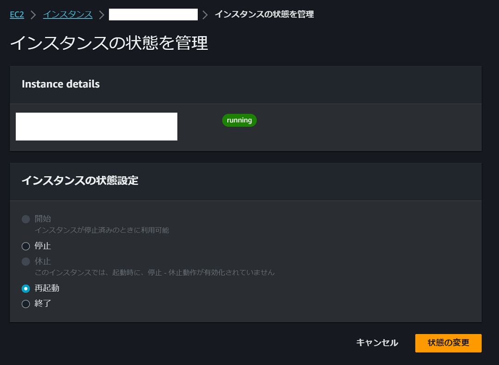

## 3.1 Ruby on Rails：開発環境の構築

ここでは、Ruby on Railsの開発環境を構築する手順を説明します。

Ruby on Railsは、その名前にあるようにRubyやRailsが必要です。また、そのRubyやRailsの動作に必要な環境やソフトウェアのインストールも必要です。

環境構築は、オペレーティングシステム(OS)によって、インストールの手順が異なります。ここでは、以下の7種類の構築手順を説明します。

 1. [macOS 用セットアップ(10.9 から 10.14)](#mac)
 2. [Windows 用セットアップ(WSLが利用できるWindows 10 64bit)](#win10)
 3. [Windows 用セットアップ(Windows 7や32bitのWindowsの場合等)](#win7)
 4. [Linux 用セットアップ(Ubuntu 18.04 LTS)](#linux)
 5. [仮想環境(VirtualBox)](#vbox)
 6. [クラウドサービス(AWS Cloud9)](#cloud9)

どのオペレーティングシステムを利用する場合でも、インターネットへ接続が必要です。その際、インストール手順によっては、ギガバイト単位でファイルをダウンロードすることもありますので、ご注意ください。

ダウンロードするファイルは、一般的にセキュリティの問題やバグで修正があればバージョン番号が上がります。以下の手順に示されているファイルのバージョンと比べて、メンテナンスバージョン(たとえば、v1.2.3でいうと3のところ)が大きくなっていることがあります。その場合は、新しいものをダウンロードしてください。

また、メジャーバージョン(たとえば、v1.2.3でいうところの1のところ)やマイナーバージョンが異なる場合は、機能の追加や廃止等の理由から期待している動作をしない可能性もありますので、ご注意ください。

<a id="mac"></a>
### [3.1.1 macOS 用セットアップ(10.9 から 10.14)]

 1. オペレーティング・システムのバージョンを調べます

    `Apple`メニューをクリックして`About This Mac`を選択します。

    開いたウィンドウに使用しているオペレーティングシステムのバージョンが表示されます。

    Version 10.9からVersion 10.14であることを確認します。

    `Dock`から、`Launchpad`、`その他`、`ターミナル`をクリックして、ターミナル画面を開きます。

    以下、ターミナル画面での作業が続きます。表示されている$の後ろからコマンドを入力します。

 2. C言語のコンパイラ等が必要なので、XcodeのCommand line toolsをインストールします

    ```bash
    xcode-select --install
    ```

 3. パッケージ管理システムのHomebrewをインストールします

    ```bash
    ruby -e "$(curl -fsSL https://raw.githubusercontent.com/Homebrew/install/master/install)"
    ```

 4. Rubyのバージョン管理システムのrbenvをインストールします

    ```bash
    brew update
    brew install rbenv
    echo 'eval "$(rbenv init -)"' >> ~/.bash_profile
    source ~/.bash_profile
    ```

 5. rbenvを使ってRubyをインストールします

    ```bash
    rbenv install 2.7.4
    ```
    もし、OpenSSLに関するエラーが表示された場合は、以下のコマンドを実行して、再試行してください。
    ```bash
    brew install curl-ca-bundle
    cp /usr/local/opt/curl-ca-bundle/share/ca-bundle.crt `ruby -ropenssl -e 'puts OpenSSL::X509::DEFAULT_CERT_FILE'`
    ```

 6. パッケージ管理システムのyarnをインストールします

    ```bash
    brew install yarn
    ```

 7. 手順5でインストールしたRubyを常用のRubyとして設定します

    ```bash
    rbenv global 2.7.4
    ```

 8. Railsをインストールをします

    ```bash
    gem install rails -v 6.1.3.2 --no-document
    ```

 9. 動作確認をします

    ```bash
    rails new sample
    cd sample
    rails g scaffold book
    rails db:migrate
    rails server
    ```
    ブラウザのURL欄に `http://localhost:3000/books` と入力して、画面が表示されれば成功です。

    動作が確認できたら、`Control`キーと`C`キーを同時に押して、Rails serverを停止しましょう。

10. コードエディタをインストールします

    コードエディタの一例です。
    すでにお気に入りのコードエディタをインストールされている場合は、それらをお使いください。
    - ATOM
    - Visual Studio Code
    - Sublime Text

<a id="win10"></a>
### 3.1.2 Windows 用セットアップ(WSLが利用できるWindows 10 64bit)

Windows 10で利用できる、WSLとUbuntuのアプリで環境を構築します。

以下の手順では、Windowsの管理者のパスワードが必要です。

 1. Windows Subsystem for Linuxをインストールします
 
    画面左下の`スタート`アイコンをクリックします。

    歯車の`設定`アイコンをクリックします。

    `アプリ`をクリックします。

    `プログラムと機能`をクリックします。

    `Windowsの機能の有効化または無効化`をクリックします

    パスワードの入力を求められたら管理者のアカウント名を確認して、パスワードを入力します

    `Windowsの機能`ダイアログが表示されるので、`Windows Subsystem for Linux`をチェックします

    `OK`ボタンをクリックします

    インストールにしばらく時間がかかります。

    再起動が必要であれば再起動します。

 2. Microsoft StoreからUbuntuをインストールします
 
    画面左下の`スタート`アイコンをクリックします。

    `Microsoft Store`をクリックします

    ルーペの`検索`アイコンをクリックします

    キーワードを入力する枠にubuntuと入力して検索します

    `Ubuntu`と表示のあるアプリ(18.04や16.04ではありません)をクリックします

    `入手`ボタンをクリックします

    `複数のデバイスで使用する`と確認される場合がありますが、ここでは`必要ありません`をクリックします。

    インストールにしばらく時間がかかります。

    `起動`ボタンをクリックします

    準備にしばらく時間がかかります。
    ```bash
    Enter new UNIX username:
    ```
    と表示されたら、任意のユーザー名を入力します。
    ```bash
    Enter new UNIX password:
    ```
    と表示されたら、任意のパスワードを入力します。
    
    今使っているWindowsアカウントのパスワードや管理者のパスワードではありません。
    ```bash
    Tetype new UNIX password:
    ```
    と表示されたら、同じパスワードを入力します。

    ２つのパスワードが一致すると
    ```bash
    xxxx@yyyy: $
    ```
    と表示されます。xxxxには、先ほどのユーザー名、yyyyはWindowsのコンピュータ名が表示されます。

    ユーザー名と、パスワードは忘れないようにしましょう。

    念のため、日本時間に合わせます
    ```bash
    sudo dpkg-reconfigure tzdata
    ```
    (補足)

    もし、コマンドをテキストから貼り付ける場合は、マウスの右ボタン(右利きの場合)をクリックすると貼り付けることができます。

    パスワードには、UNIXのパスワードを入力します。

    AsiaとTokyoを選択します。ただし`OK`を選択するためにはマウスは使えないので、`TAB`キーを数回押して移動して選択してください。
    ```bash
    date
    ```
    と入力して、Asia/Tokyoと表示されれば設定できています。

 3. UNIX環境を最新化します

    ```bash
    sudo apt update
    sudo apt upgrade -y
    sudo apt install autoconf bison build-essential libssl1.0-dev libyaml-dev libreadline-dev zlib1g-dev libncurses5-dev libffi-dev libgdbm-dev sqlite3 libsqlite3-dev nodejs-dev node-gyp npm -y
    sudo npm install --global yarn
    ```

 4. Rubyのバージョン管理システムのrbenvをインストールします

    ```bash
    git clone https://github.com/rbenv/rbenv.git ~/.rbenv
    echo 'export PATH="$HOME/.rbenv/bin:$PATH"' >> ~/.bashrc
    echo 'eval "$(rbenv init -)"' >> ~/.bashrc
    source ~/.bashrc
    git clone https://github.com/rbenv/ruby-build.git "$(rbenv root)"/plugins/ruby-build
    ```

 5. rbenvを使ってRubyをインストールします

    ```bash
    rbenv install 2.7.4
    ```

 6. 手順5でインストールしたRubyを常用のRubyとして設定します

    ```bash
    rbenv global 2.7.4
    ```

 7. Railsをインストールをします

    ```bash
    gem install rails -v 6.1.3.2 --no-document
    ```

 8. 動作確認をします

    ```bash
    rails new sample
    cd sample
    rails g scaffold book
    rails db:migrate
    rails server
    ```
    ブラウザのURL欄に `http://localhost:3000/books` と入力して、画面が表示されれば成功です。

    動作が確認できたら、`CTRL`キーと`C`キーを同時に押して、Rails serverを停止しましょう。

    (補足)

    UNIX環境で、
    ```bash
    explorer.exe .
    ```
    とすることで、作業しているディレクトリ(カレントディレクトリ)をWindowsのエクスプローラで参照できます。
    この場所をWindows上にインストールしたコードエディタで参照することでファイルを編集できます。

 9. コードエディタをインストールします。

    コードエディタの一例です。エディタはWindows用をダウンロードして、インストールします。
    すでにお気に入りのコードエディタをインストールされている場合は、それらをお使いください。
    - ATOM
    - Visual Studio Code
    - Sublime Text


<a id="win7"></a>
### 3.1.3 Windows 用セットアップ(Windows 7や32bitのWindowsの場合等)

プログラム開発では、同じファイル名で、拡張子だけ違うファイルを取り扱うことが多々ありますので、エクスプローラの設定で、フォルダーオプションの表示から、`登録されている拡張子は表示しない`のチェックを外すことをお勧めします。

 1. Rubyのインストーラをダウンロードします。

    以下のURLを開きます。

    https://rubyinstaller.org/downloads/

    英語でページが表示されますが、WITH DEVKITの中から

    64bitの場合は、Ruby+Devkit 2.7.4-1 (x64)をクリックしてダウンロードします。

    32bitの場合は、Ruby+Devkit 2.7.4-1 (x86)をクリックしてダウンロードします。

    ダウンロードにしばらく時間がかかります。

 2. Rubyのインストール

    ダウンロードフォルダからダウンロードしたファイル(rubyinstaller-devkit-2.7.4-1-x64.exe等)をダブルクリックして実行します。

    実行の確認、使用ライセンスの確認は、それぞれ`実行`と`I accept the License`を選択して進めます。

    インストール先の場所(パス)等を確認されます。

    インストール先は、C:¥Ruby27-x64(そのまま)

    Add Ruby executables to your PATHにチェック(そのまま)

    Associate .rb and .rbw files with this Ruby installationにチェック(そのまま)

    Use UTF-8 as default external encoding.にチェック

    `Install`ボタンをクリックします。

    Select Componentsの画面が表示されますので、2つがチェックされた状態で`Next`ボタンをクリックします。

    インストールが成功すると、Completing the Ruby 2.7.4-1-x64 with MSYS2 Setup Wizardと表示されますので、`Finish`ボタンをクリックします(インストールは続きます)。

    コマンドプロンプトが立ち上がってMSYS2のインストールに進みますのでデフォルトの選択肢(何も入力せずにエンターキー)を選びます。

    必要なファイルをインターネットからダウンロードして、インストールがされるのでしばらく時間がかかります。

    再度、`1,2,3`から選択するように表示されますのでデフォルトの選択肢(何も入力せずにエンターキー)を選びます。(コマンドプロンプトの画面が閉じられます)

 3. Railsで使用している外部プログラム(JavaScriptライブラリ等)をインストールします

    以下のURLを開きます。

    https://nodejs.org/ja/download/

    64bitの場合は、Windows Installer(.msi)の64-bitをクリックしてダウンロードします。

    32bitの場合は、Windows Installer(.msi)の32-bitをクリックしてダウンロードします。

    ダウンロードフォルダから、ダウンロードしたファイルをダブルクリックして実行します。

    実行の確認、使用ライセンスの確認は、それぞれ`実行`と`I accept the License`を選択して進めます。

    以下のURLを開きます。

    https://yarnpkg.com/ja/docs/install#windows-stable

    OSが`Windows`、バージョンが`安定板(1.19.1)`になっていることを確認して`インストーラをダウンロードする`ボタンをクリックします。

    ダウンロードフォルダから、ダウンロードしたファイルをダブルクリックして実行します。

 4. Railsをインストールします

    画面左下の`スタート`から、`すべてのプログラム`、`アクセサリ`、`コマンドプロンプト`をクリックして、コマンドプロンプトの画面を作成します。
    ```
    gem install rails -v 6.1.3.2 --no-document
    ```

 5. データベース関連をインストールします

    以下のURLを開いて、SQLiteのダウンロードとインストールをします。

    https://www.sqlite.org/download.html

    英語で表示されますが、Precompiled Binaries for Windowsの中から

    64bitの場合は、sqlite-dll-win64-x64-3300100.zipをクリックしてダウンロードします。

    32bitの場合は、sqlite-dll-win32-x86-3300100.zipをクリックしてダウンロードします。

    64bit、32bitともに、sqlite-tools-win32-x86-3300100.zipもダウンロードします。

    ダウンロードフォルダからダウンロードした2つの圧縮ファイルをダブルクリックして展開します。
    ```
    sqlite3.def
    sqlite3.dll
    ```
    ```
    sqldiff.exe
    sqlite3.exe
    sqlite3_analyzer.exe
    ```
    2つと3つのファイルが展開されますので、今回は、5つのファイルを先ほどRubyをインストールした以下のフォルダのbinの中にコピーします(64bitの場合)。
    ```
    C:¥Ruby27-x64¥bin
    ```

    Railsとデータベースを接続するアダプタをソースコードからコンパイルしてインストールします。
    ```bash
    gem install sqlite3 -v '1.4.1' --source 'https://rubygems.org/'
    ```

    (補足)

    以下のようなエラーが表示された場合も、この手順でgemとデータベースSQLiteをインストールします。

    エラーメッセージ(例)
    ```bash
    An error occurred while installing sqlite3 (1.4.1), and Bundler cannot continue.
    Make sure that `gem install sqlite3 -v '1.4.1' --source 'https://rubygems.org/'`
    ```

 6. 動作確認をします

    ```bash
    rails new sample
    cd sample
    rails g scaffold book
    rails db:migrate
    rails server
    ```
    ブラウザのURL欄に `http://localhost:3000/books` と入力して、画面が表示されれば成功です。

    動作が確認できたら、`CTRL`キーと`C`キーを同時に押して、Rails serverを停止しましょう。

    (補足)

    以下ののようなエラー表示がされた場合はGemfileを修正します。
    ```
    'x64_mingw' is not a valid platform
    ```
    ```
    gem 'tzinfo-data', platforms: [:mingw, :mswin, :x64_mingw]
    ```
    の行を
    ```
    gem 'tzinfo-data', platforms: [:mingw, :mswin]
    ```
    となるように修正、保存して、コマンド
    ```bash
    bundle update
    ```
    を実行します。

 7. コードエディタをインストールします

    コードエディタの一例です。
    すでにお気に入りのコードエディタをインストールされている場合は、それらをお使いください。
    - ATOM
    - Visual Studio Code
    - Sublime Text

<a id="linux"></a>
### 3.1.4 Linux 用セットアップ(Ubuntu)

 1. Rubyのインストールに必要なコマンド等をインストールします

    ```bash
    sudo apt update
    sudo apt upgrade -y
    sudo apt install git curl net-tools gcc make -y
    ```

 2. Ruby on Railsの環境に必要なライブラリ等をインストールします

    ```bash
    sudo apt install autoconf bison build-essential libssl1.0-dev libyaml-dev libreadline-dev zlib1g-dev libncurses5-dev libffi-dev libgdbm-dev sqlite3 libsqlite3-dev -y
    ```

    (補足)
    
    Ubuntu 16.04LTSでlibssl1.0-devが見つからないというエラーが表示された場合、libssl-devと修正して再試行してください。

 3. Rubyのバージョン管理システムのrbenvをインストールします

    ```bash
    git clone https://github.com/rbenv/rbenv.git ~/.rbenv
    echo 'export PATH="$HOME/.rbenv/bin:$PATH"' >> ~/.bashrc
    echo 'eval "$(rbenv init -)"' >> ~/.bashrc
    source ~/.bashrc
    git clone https://github.com/rbenv/ruby-build.git "$(rbenv root)"/plugins/ruby-build
    ```

 4. rbenvを使ってRubyをインストールします

    ```bash
    rbenv install 2.7.4
    ```

 5. 手順4でインストールしたRubyを常用のRubyとして設定します

    ```bash
    rbenv global 2.7.4
    ```

 6. Node.jsをインストールする為のnodenvをインストールします

    ```bash
    git clone https://github.com/nodenv/nodenv.git ~/.nodenv
    git clone https://github.com/nodenv/node-build.git ~/.nodenv/plugins/node-build
    echo 'export PATH="$HOME/.nodenv/bin:$PATH"' >> ~/.bashrc
    echo 'eval "$(nodenv init -)"' >> ~/.bashrc
    source ~/.bashrc
    ```

 7. nodenvを使ってNode.jsをインストールします

    ```bash
    nodenv install 16.14.0
    ```
 
 8. 手順7でインストールしたNode.jsを常用のnodeとして設定します 
 
     ```bash
    nodenv global 16.14.0
    ```

 9. Railsをインストールをします

    ```bash
    gem install rails -v 6.1.3.2 -N
    ```

 10. yarnをインストール

     ```bash
    curl -sS https://dl.yarnpkg.com/debian/pubkey.gpg | sudo apt-key add -
    echo "deb https://dl.yarnpkg.com/debian/ stable main" | sudo tee /etc/apt/sources.list.d/yarn.list
    sudo apt update
    sudo apt install yarn
    sudo apt remove nodejs
    sudo ln -s `which node` /usr/bin/node
    ```
    
    メモ:
    個々のユーザーディレクトリに存在するnodeコマンドを/usr/bin/nodeにリンクを張るのは筋が悪いのですが
    /usr/bin/nodeにコマンドがあることが期待されることがあるので暫定対応です。


 11. 動作確認をします

      ```
      rails new sample
      cd sample
      rails g scaffold book name:string
      rails db:create
      rails db:migrate
      rails server
      ```
      ブラウザのURL欄に `http://localhost:3000/books` と入力して、画面が表示されれば成功です。

      動作が確認できたら、`CTRL`キーと`C`キーを同時に押して、Rails serverを停止しましょう。

 12. コードエディタをインストールします。

      コードエディタの一例です。
      すでにお気に入りのコードエディタをインストールされている場合は、それらをお使いください。
      - ATOM
      - Visual Studio Code
      - Sublime Text

<a id="vbox"></a>
### 3.1.5 仮想環境(VirtualBox)

コンピュータの中に、別のコンピュータの環境を構築できる仮想環境ソフトウェアとしてVirtualBoxやVMware、Hyper-V等がありますが、ここではVirtualBoxを使用します。

また、仮想環境内に構築する開発環境はUbuntu 18.04 LTS(32bitの場合はUbuntu 16.04 LTS)を使用します。

仮想環境はウィンドウやマウスを使用するGUIの環境で構築しますので、使用するコンピュータが搭載しているメモリは4GB以上、ハードディスクやSSD等の補助記憶装置には空き領域が25GB以上あることを確認してください。

 1. ダウンロードします

    以下のURLを開きます。

    https://www.virtualbox.org/wiki/Downloads

    使用しているコンピュータ(ホスト)のOSによってWindows hosts、OS X hostsをクリックします。

    ホストが32bitの場合は、Version 5.2の最新を以下のURLからダウンロードします。

    https://www.virtualbox.org/wiki/Download_Old_Builds_5_2

 2. インストールします

    ダウンロードフォルダからダウンロードしたファイルをダブルクリックして実行します。

    インストールの途中に、構成の確認がありますが、変更せず`Next`ボタンをクリックして進めます。

    また、仮想のネットワークアダプタを追加する確認画面が表示されますが、`インストール`を選択して進めます。

 3. 仮想環境の中に構築するOSのインストーラをダウンロードします

    64bitの場合は、以下のURLからUbuntu Desktopの18.04 LTSをクリックしてダウンロードします。

    https://ubuntu.com/#download

    32bitの場合は、以下のURLから16.04 LTSの32-bit PC(i386) desktop imageをダウンロードします。

    http://releases.ubuntu.com/xenial/

 4. 仮想環境の構築

    VirtualBoxマネージャが表示されていなければ、画面左下の`スタート`、`すべてのプログラム`、`Oracle VM VirtualBox`、`Orale VM VirtualBox`をクリックして起動します。

    `新規`アイコンをクリックします。

    仮想環境の構成を決定します。32bitの場合は適宜調整してください。

         名前[(例:Ruby on Rails)]

         タイプ[Linux]

         バージョン[Ubuntu(64-bit)]

         メモリ[1024]MB (ホストのメモリに余裕があれば2048MB程度が良いです)

         仮想ハードディスク[仮想ハードディスクを作成する]

         仮想ハードディスクの種類[VDI/可変サイズ]

         仮想ハードディスクのサイズ[10.00GB] (ホストのディスク空き容量に余裕があれば20.00GB程度が良いです)

         [作成]ボタンをクリックして設定完了

    手順3でダウンロードしたOSのイメージを作成した仮想環境に割り当てます。

         [ストレージ]から、[IDE セカンダリマスター]の右横に表示されている
         
         [光学ドライブ]空
         
         をクリックして、[ディスクイメージを選択...]をクリックします。

         ダウンロードフォルダから、手順3でダウンロードしたファイルを選択します。

    ネットワークの設定を行います。

         [ネットワーク]から、[割り当て]の右横に表示されている[NAT]をクリックして、

         [ブリッジアダプター]に変更します。
   
    `起動`アイコンをクリックして仮想環境を起動します。

    言語から`日本語`をクリックします。

    `Ubuntuをインストール`ボタンをクリックします。

    キーボードの選択は、コンピュータに合うキーボードを選択し、アットマーク(@)や、ダブルクオート(")の文字を入力し、正しく表示されることを確認して`続ける`ボタンをクリックします。

    `通常のインストール`で`続ける`

    `ディスクを削除してUbuntuをインストール`を選択して`インストール`、`続ける`をクリックします。

    **注意！！**

    **ここでは、仮想環境の中で作業をしているので、ディスクとは仮想環境の中の仮想ディスクのことです。**

    場所(タイムゾーン)の選択で`Tokyo`を選択します。

    利用するアカウント、コンピュータ名、パスワードを入力して進めます。

    アカウントと、パスワードは忘れないようにしましょう。

    インストールにしばらく時間がかかります。

    インストール完了のメッセージが表示されたら`今すぐ再起動する`ボタンをクリックします。
    ```
    Please remove the installation medium, then press ENTER:
    ```
    と表示されるのでエンターキーを押します。

 5. 仮想環境へのログインとゲスト環境用追加ソフトウェアのインストール

    インストールのときに入力したアカウントを選択、パスワードを入力してログインします。

    仮想環境の中で`Ubuntuの新機能`を説明するウィンドウが表示されたら、画面上部の`Ubuntuへようこそ`から`終了`をクリックします。Ubuntu 16.04 LTSの場合は、キー操作の画面が表示されますので、その画面を終了します。

    仮想環境の中の左下から、`アプリケーションを表示する`アイコンをクリックし、検索ワードに`term`と入力します。
    
    Ubuntu 16.04 LTSの場合は、仮想環境の中の左上から、`コンピュータを検索`アイコンをクリックし、検索ワードに`term`と入力します。

    端末が表示されるので、クリックします。

    日本語環境の構築をします(参考：https://www.ubuntulinux.jp/japanese)。

    Ubuntu 18.04 LTSの場合:
    ```bash
    wget -q https://www.ubuntulinux.jp/ubuntu-ja-archive-keyring.gpg -O- | sudo apt-key add -
    wget -q https://www.ubuntulinux.jp/ubuntu-jp-ppa-keyring.gpg -O- | sudo apt-key add -
    sudo wget https://www.ubuntulinux.jp/sources.list.d/bionic.list -O /etc/apt/sources.list.d/ubuntu-ja.list
    ```

    Ubuntu 16.04 LTSの場合:
    ```bash
    wget -q https://www.ubuntulinux.jp/ubuntu-ja-archive-keyring.gpg -O- | sudo apt-key add -
    wget -q https://www.ubuntulinux.jp/ubuntu-jp-ppa-keyring.gpg -O- | sudo apt-key add -
    sudo wget https://www.ubuntulinux.jp/sources.list.d/xenial.list -O /etc/apt/sources.list.d/ubuntu-ja.list
    ```

    共通:
    ```bash
    sudo apt update
    sudo apt upgrade -y
    sudo apt install gcc make perl -y
    sudo apt install ubuntu-defaults-ja
    ```

    右上の`電源`アイコンをクリックし、さらに`電源`アイコンをクリック、`再起動`をクリックします。

    再度、ログインします。

    VirtualBoxのメニューから`デバイス`、`Guest Additions CD イメージの挿入...`をクリックして、`実行する`を選択、パスワードを入力します。

    インストールが完了すると、
    ```
    Press Return to close this window...
    ```
    と表示されるのでエンターキーを押します。

 7. Rails環境の構築

    ここからは、Linux 用セットアップ(Ubuntu)と同じですので、[Linux用セットアップ](#linux)を参照してください。

<a id="cloud9"></a>
### 3.1.6 クラウドサービス(AWS Cloud9)

[AWS Cloud9のサイト](https://aws.amazon.com/jp/cloud9/)

 1. ブラウザを選択する

    Internet Explorer を利用している場合は、[Google Chrome](https://www.google.com/intl/ja/chrome/)または[Firefox](https://www.mozilla.org/ja/firefox/new/)をインストールしてください。(一部の機能がIEでは動かない場合があります。)

 2. アカウントを作成する

    AWSのアカウントを作成し、AWS Cloud9 コンソールにサインインしましょう。
    具体的には 個人ユーザーの [AWS Cloud9 セットアップ - AWS Cloud9](https://docs.aws.amazon.com/ja_jp/cloud9/latest/user-guide/setup-express.html) の手順で作業を進めてください。
    サインイン後に [Welcome to AWS Cloud9](https://console.aws.amazon.com/cloud9/home/product) にアクセスして次のような画面が出たらOKです。

    

 3. Ruby on Rails の開発用に Enviroment を設定する

    [Welcome to AWS Cloud9](https://console.aws.amazon.com/cloud9/home/product) にアクセスしてください。(サインインしていない場合は先にサインインをしてください)
    Create environment をクリックします。
    Environment name には好きな名前をつけましょう。Descriptionは任意なので空欄でも構いません。Next Step をクリックしましょう。
    Configure settings では Platform に Ubuntu Server を指定してください。その他は初期設定のままでOKです。Next Step をクリックしてください。
    Review で入力内容を確認します。Create environment をクリックしましょう。
    利用可能になるまで少し待ってください。
    次のような画面が開いたらOKです。

    

    以降の手順ではこの画像の下部にあるターミナルを使います。

 4. 標準でインストールされている RVM をアンインストールする

    4.1. **RVM 関連ファイルの削除**

    ```bash
    /usr/bin/sudo rm -rf $HOME/.rvm 
    ```

    4.2. **RVM 関連設定の削除**

    ```bash
    sed -i -e '/rvm/d' ~/.bashrc
    ```

    4.3. **AWS Cloud9 のインスタンスを再起動して操作を反映させる**

    AWS Cloud9 を再起動して `$GEM_HOME`, `$GEM_PATH` を更新します。

    画面右上のメニューから Manage EC2 Instance をクリックしてEC2の管理画面に移動しましょう。
    

    アクション をクリックして インスタンスの状態 のメニューから 再起動 をクリックしてください。
    

    AWS Cloud9 の画面に戻りましょう。少し待って利用可能な状態になったら再起動は完了です。

    これで RVM が正常にアンインストールされました。

 5. Railsのインストール

    次のコマンドを1行ずつ実行すると各種インストールが完了します。

    ```bash
    sudo apt-get update -y
    sudo apt-get install -y snapd
    sudo snap install node --classic --channel=10
    sudo apt-get --ignore-missing install build-essential git-core curl openssl libssl-dev libcurl4-openssl-dev zlib1g zlib1g-dev libreadline6-dev libyaml-dev libsqlite3-dev libsqlite3-0 sqlite3 libxml2-dev libxslt1-dev libffi-dev software-properties-common libgdm-dev libncurses5-dev automake autoconf libtool bison postgresql postgresql-contrib libpq-dev pgadmin3 libc6-dev -y
    sudo apt-get install imagemagick --fix-missing -y
    git clone https://github.com/rbenv/rbenv.git ~/.rbenv
    echo 'export PATH="$HOME/.rbenv/bin:$PATH"' >> ~/.bashrc
    echo 'eval "$(rbenv init -)"' >> ~/.bashrc
    source ~/.bashrc
    git clone https://github.com/rbenv/ruby-build.git "$(rbenv root)"/plugins/ruby-build
    rbenv install 2.7.4
    rbenv global 2.7.4
    gem install rails -v 6.1.3.2 --no-document
    ```

 6. プロジェクトを作成する場合に

    左側はフォルダとファイルを表示、選択できます。
    中央部はエディタです。ここでファイルを編集します。
    下部はターミナルです。ここでコマンドを実行します。
    必要なものは全てブラウザにあります。ブラウザのほかにエディタやターミナルを起動する必要はありません。
    ガイドやチュートリアルを読む場合には、(Windowsマシンを利用している場合でも)Linux用のコマンドを使ってください。コマンドはクラウド上で実行され、その環境がLinuxマシンだからです。
    ガイドやチュートリアルで、サーバを起動する時のコマンドは `rails server` ではなく `rails server -b 0.0.0.0` を実行してください。何も指定しなかった場合はコマンドを実行した環境以外からはアクセスできないため、操作しているマシンからも表示がうまく行えません。
    ガイドやチュートリアルで、ブラウザから例えば `http://localhost:3000` へアクセスする場合は、アドレス欄に入力するのではなく、画面上部から ‘Preview’ - ‘Priview Running Application’ を選ぶことで同じ操作ができます。
    例えば、 `http://localhost:3000/posts` へアクセスしたい場合は、’Preview’ - ‘Priview Running Application’ を選んだあと、 ‘/posts’ をアドレス欄の末尾に加えてください。

 7. 動作確認

    ```bash
    rails new sample
    cd sample
    rails g scaffold book
    rails db:migrate
    rails server -b 0.0.0.0
    ```
    ブラウザのURL欄に `http://localhost:3000/books` と入力して、画面が表示されれば成功です。

    動作が確認できたら、`CTRL`キーと`C`キーを同時に押して、Rails serverを停止しましょう。
