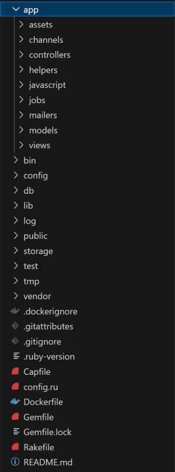

## 5.1 Ruby on Rails：Rails基礎 2

### 5.1.1 アプリの構造解説
重要な部分を抜粋して紹介していきます。  


   - **app**  
      アプリケーション本体が格納される  

   - **assets**  
        WEBページ内で使用するimageファイルや、ページのレイアウトに使用するcss、  
        ページの動きを制御するjs等が格納される  

   - **controllers**  
        ユーザーアクションを基にアプリを制御するcontrollerが格納される  
        MVCの"C"  

   - **helpers**  
        「ヘルパーメソッド」と呼ばれるメソッドをまとめたファイルが格納される  
        「ヘルパーメソッド」とは、主にviewを記述する際に役立てるメソッドであり、
        フォーム要素の生成、文字列や数値の整形するメソッド等、viewでよく利用する操作がデフォルトで用意されている
        例えば、`link_to`メソッドでは、与えられた引数を元にハイパーリンクを生成することができる
        ここでは、独自に使用するヘルパーメソッドを定義する

   - **models**  
        データの処理全般を管理するmodelが格納される  
        MVCの"M"  

   - **views**  
        画面に表示する部分のviewが格納される  
        MVCの"V"  

   - **config**  
      Railsアプリの設定に関するファイルが格納される  
      ルーティングを制御するroutes.rb等が格納されている  
      ルーティングとは、ブラウザからのリクエスト(URL)をサーバ側のRailsと結びつける仕組みである

   - **db**  
      DB関係のファイルが格納される  
      DBのテーブルをアプリ側から操作出来るようにしたmigrationファイルや、  
      DBの初期投入データを管理できるseeds.rb等が格納されている  

   - **test**  
      テスト関係のファイルが格納される  
      今回は使用せず、RSpec導入したあとに出来るspecフォルダを代わりに使用する

   - **Gemfile**  
      アプリで使用するgemをまとめたファイル  
      gemの種類だけでなく、バージョンや使う環境を限定出来る  

<br>
では次からは、実際に簡単なアプリとしてカスタマイズしていきながら、  
Railsの各種機能に触れて学んでいきましょう。  

### 5.1.2 Railsの基本
__【scaffoldコマンド】__   
自前でページを作成するには、必要なものが多くあります。  
例えば画面に表示するViewであったり、登録処理をするならそのためのテーブルも必要ですし、  
テーブルを操作するためのModelや、それらを制御するControllerも必要です。  
また、WEBページにアクセスした時に画面表示等の処理を行うには、  
ブラウザで入力したURLとアプリの処理を連動できるようにしなければいけません。  
そのためには、routes.rbというファイルに設定を書き込む必要があります。（ルーティング）  

この、WEBページで何か機能を使用するために必要なものの塊を`リソース`と呼びます。  
リソースを全て1から作るのは中々大変ですが、Railsではこのリソースを一括で作成できる  
`scaffold`という機能があります。早速この機能を使用してみましょう。  
前回作成した`railsbasic`のアプリに移動しましょう。  

```sh
$ cd railsbasic
```

```sh
$ rails generate scaffold User name:string email:string
```

`rails generate`がファイルを作成するコマンドで、`scaffold`はそのうちのモードの1つです。  
`User`は生成されるファイルの名前のベースになります。  
生成されるファイルは大体命名規則があるので、それに則ってファイルの名前を付けてくれます。  
あとの`name:string email:string`は、テーブルで使用するカラムを予約しておくためのものです。  
このscaffoldをした段階では、まだテーブルだけは生成されていないので後でも大丈夫なのですが、  
この時点で予約しておくとちょっと便利なことがあるので、オプションとして付けておきます。  
また、`rails generate`は`rails g`と省略できます。    

このコマンドを実行すると、また新たにファイルやフォルダが生成されていると思います。  
万が一間違えて作成してしまった場合は`rails d`とすることで削除できますので覚えておきましょう。  
それらについては、また後ほど個別に解説していきます。  
<br>

__【CRUDについて】__   
Webアプリケーションには、基本となる新規作成 (Create)、表示 (Read)、更新 (Update)、削除 (Delete) の
4つの機能があります。これらの頭文字を取って `CRUD` と呼ばれています。
`scaffold`では、新規作成、表示、更新、削除の各機能も一括で作成されています。

__【テーブルの作成】__  
先に話した通り、DBのテーブルだけはまだ生成されていません。  
ただし、実はテーブルを生成するための準備はもう出来ています。  

そもそもテーブルを作るためには、本来ならDBのコマンドを直接実行してDBを操作しなくてはいけません。  
しかし、Railsではアプリ側からDBを操作することが出来ます。  
そのDBの操作に使われるのが、`migration`という機能です。  
このmigrationでは、テーブルを生成したり、テーブルのカラムを変更したりすることが出来ます。  

「準備が出来ている」と言ったのは、先程scaffoldを使用した時に、  
このmigrationの機能を使うためのファイルが出来ているからです。  
そのファイルは`/db/migrate/`の配下にあり、ファイル名は`日時_create_users.rb`になっています。  
中身を見てみると、以下のようになっています。  

```rb    
class CreateUsers < ActiveRecord::Migration[7.1]
  def change
    create_table :users do |t|
      t.string :name
      t.string :email

      t.timestamps
    end
  end
end
```

コマンドのオプションとして付けておいたカラムが入っていますね。  
他にも`timestamps`という記述がありますが、これはscaffoldで生成すると自動で書き込まれるものです。  
この記述を入れておくと、テーブルにレコードの作成日時と更新日時を記録するためのカラムが追加されます。  
この2つの日時は、登録・更新時に勝手に記録してくれる等、Rails側で管理してくれるようになっています。  

このファイルを使用してmigrationを行うには、以下のコマンドを実行します。  

```sh
$ rails db:migrate
```

これでテーブルが生成されるので、リソースが機能として使用出来るようになりました。  

試しにRailsアプリを起動して、ブラウザでページを開いたあと、URLの末尾に`/users`と付け足してみて下さい。  
そのURLでページを移動すると、ほぼ真っ白なUsersと書かれたページが表示されていると思います。  
これはテーブルの情報を一覧で表示するページで、「New User」のリンクを押すと新規登録ページに移動します。  
新規登録したあとには一覧ページに登録したデータが表示され、そこから編集等の操作が出来るようになっています。

このように、まだデザインもシンプルで機能も最低限に留まってはいますが、  
WEBページとして欲しい機能の基礎が出来上がりました。  

これはどういう仕組みで動いているのでしょうか？  
具体的な仕組みや構造を、生成された各ファイルを見ながら辿ってみましょう。  

__【routes.rb】__  
まず初めに、ルーティングの確認をしてみましょう。  
先程URLの末尾に`/users`を付け足して、きちんとページが表示されたということは、  
そのURLにアプリが対応できるようになったということです。  
その設定は`/config/routes.rb`のファイルに書かれているはずなので、そのファイルを確認してみましょう。  

```rb
# config/routes.rb
Rails.application.routes.draw do
  resources :users
  ・
  ・
  ・
end
```

記述の中に`resources :users`と書かれている部分がありますね。  
実はこの一行のコードで、8個分のルーティングが設定できるようになっています。  

このルーティングの設定は、以下のコマンドで確認できます。  
Railsアプリを実行中の場合は、もう一つターミナルを立ち上げて実行してみてください。  

```sh
$ rails routes
```

実行すると以下のような内容が表示されるはずです。  

```sh
   Prefix Verb   URI Pattern               Controller#Action
    users GET    /users(.:format)          users#index
          POST   /users(.:format)          users#create
 new_user GET    /users/new(.:format)      users#new
edit_user GET    /users/:id/edit(.:format) users#edit
     user GET    /users/:id(.:format)      users#show
          PATCH  /users/:id(.:format)      users#update
          PUT    /users/:id(.:format)      users#update
          DELETE /users/:id(.:format)      users#destroy
```

右端の列にあるのは、アクションメソッドと呼ばれるControllerに定義されたメソッドです。  
上記の一覧では、「特定のURLにアクセスすると、それに対応したControllerのメソッドが呼び出される」  
ということが表されています。このアクションメソッドを`CRUD`に当てはめると下記のようになります。  

|CRUD|アクション|
|:--|:--|
|Create|新規作成(new, create)|
|Read|データ一覧・個別の表示(index, show)|
|Update|データの更新(edit, update)|
|Delete|データの削除(destroy)|
