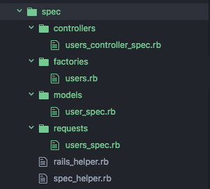

## 7.3.5　Ruby on Rails：Railsテスト基礎 2

### 7.3.5.1 RSpecのテンプレート作成

ここまでの長い道のり、お疲れ様でした。ここからやっとRSpecの実装を始めることができます。ここでは例題として利用者の氏名と電話番号を登録できるRailsアプリケーションを作成しましょう。

  ```
  rails g scaffold User name:string phone_number:string
  ```

  結果
  ```sh
  ・
  ・
      invoke    rspec
      create      spec/models/user_spec.rb
      invoke      factory_bot
      create        spec/factories/users.rb
  ・
  ・
      invoke    rspec
      create      spec/requests/users_spec.rb
      invoke    helper
      create      app/helpers/users_helper.rb
      invoke      rspec
  ・
  ・
  ```

specフォルダに新しくファイルが作成できたでしょうか。RailsはMVCパターンでプログラムを作成するのでModel、View、Controllerのそれぞれにテストを実装します。テストで実装すべき観点は次の通りそれぞれ異なります。



- controllers/users_controller_spec.rb  
Controller への単体テストを観点に実装する。HTTPステータスコードが期待通りであるか、メソッド実行後にデータベースへの操作が期待通りであるかをテストする。
- models/user_spec.rb  
Model への単体テストを観点に実装する。仕様書通りにバリデータが実装されているか、スコープの結果が期待通りであるかをテストする。
- requests/users_spec.rb  
ルーティング、生成されたHTMLがシナリオとおりであるかを検証する。

ここまで、View についてのテストがないとお気づきかもしれません。View はデザインと結びつきが強くHTMLの構造が頻繁に変更されます。そのため、メンテナンスすることが難しくrequestsなどの結合テストに含めることが多いです。仕事でRailsアプリケーションを開発する際は、会社によって開発規約が異なりますので、View が必須の場合もあります。

### 7.3.5.2 RSpecの実行方法

RSpecを実行して結果を確認してみましょう。まず、テスト環境のデータベースを作成します。

  ```sh
  $ RAILS_ENV=test rails db:migrate
  ```

  結果
  ```sh
  Running via Spring preloader in process 55637
  == 20170828063211 CreateUsers: migrating ==================================
  -- create_table(:users)
    -> 0.0011s
  == 20170828063211 CreateUsers: migrated (0.0014s) =========================
  ```

では、データベースが問題なく作成できたら、実行してみましょう

  ```sh
  $ bin/rake
  ```

  結果
  ```sh
・
・
User
  add some examples to (or delete) /home/otomo/rspec_practice/spec/models/user_spec.rb (PENDING: Not yet implemented)

/users
  GET /index
    renders a successful response (PENDING: Add a hash of attributes valid for your model)
  GET /show
    renders a successful response (PENDING: Add a hash of attributes valid for your model)
  GET /new
    renders a successful response
  GET /edit
    render a successful response (PENDING: Add a hash of attributes valid for your model)
  POST /create
    with valid parameters
      creates a new User (PENDING: Add a hash of attributes valid for your model)
      redirects to the created user (PENDING: Add a hash of attributes valid for your model)
    with invalid parameters
      does not create a new User (PENDING: Add a hash of attributes invalid for your model)
      renders a successful response (i.e. to display the 'new' template) (PENDING: Add a hash of attributes invalid for your model)
  PATCH /update
    with valid parameters
      updates the requested user (PENDING: Add a hash of attributes valid for your model)
      redirects to the user (PENDING: Add a hash of attributes valid for your model)
    with invalid parameters
      renders a successful response (i.e. to display the 'edit' template) (PENDING: Add a hash of attributes valid for your model)
  DELETE /destroy
    destroys the requested user (PENDING: Add a hash of attributes valid for your model)
    redirects to the users list (PENDING: Add a hash of attributes valid for your model)

Pending: (Failures listed here are expected and do not affect your suite's status)

  1) User add some examples to (or delete) /home/otomo/rspec_practice/spec/models/user_spec.rb
     # Not yet implemented
     # ./spec/models/user_spec.rb:4

  2) /users GET /index renders a successful response
     # Add a hash of attributes valid for your model
     # ./spec/requests/users_spec.rb:27

  3) /users GET /show renders a successful response
     # Add a hash of attributes valid for your model
     # ./spec/requests/users_spec.rb:35

  4) /users GET /edit render a successful response
     # Add a hash of attributes valid for your model
     # ./spec/requests/users_spec.rb:50

  5) /users POST /create with valid parameters creates a new User
     # Add a hash of attributes valid for your model
     # ./spec/requests/users_spec.rb:59

  6) /users POST /create with valid parameters redirects to the created user
     # Add a hash of attributes valid for your model
     # ./spec/requests/users_spec.rb:65

  7) /users POST /create with invalid parameters does not create a new User
     # Add a hash of attributes invalid for your model
     # ./spec/requests/users_spec.rb:72

  8) /users POST /create with invalid parameters renders a successful response (i.e. to display the 'new' template)
     # Add a hash of attributes invalid for your model
     # ./spec/requests/users_spec.rb:78

  9) /users PATCH /update with valid parameters updates the requested user
     # Add a hash of attributes valid for your model
     # ./spec/requests/users_spec.rb:91

  10) /users PATCH /update with valid parameters redirects to the user
     # Add a hash of attributes valid for your model
     # ./spec/requests/users_spec.rb:98

  11) /users PATCH /update with invalid parameters renders a successful response (i.e. to display the 'edit' template)
     # Add a hash of attributes valid for your model
     # ./spec/requests/users_spec.rb:107

  12) /users DELETE /destroy destroys the requested user
     # Add a hash of attributes valid for your model
     # ./spec/requests/users_spec.rb:116

  13) /users DELETE /destroy redirects to the users list
     # Add a hash of attributes valid for your model
     # ./spec/requests/users_spec.rb:123


Finished in 0.67594 seconds (files took 6.03 seconds to load)
14 examples, 0 failures, 13 pending
  ```

`rails g scaffold`コマンドだけでこれだけのテストが自動生成されることが分かると思います。これらのテストひとつずつに正しい実装をしていきます。
