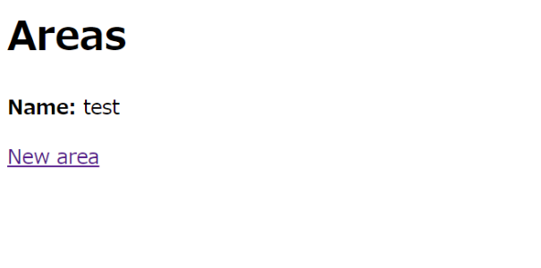
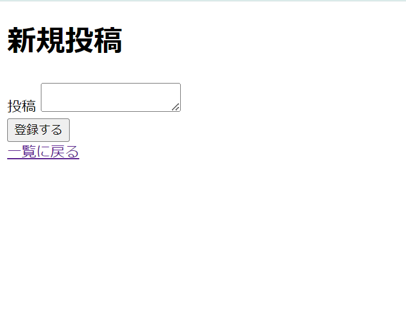
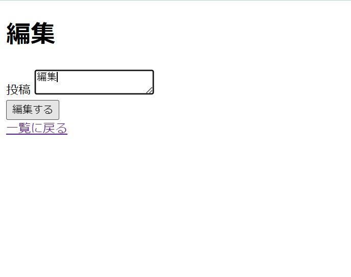

## 8.1 Ruby on Rails：ECサイトの開発 商品一覧2

### 8.1.1 画面遷移とルーティングの実装

#### (b) 例題

以下は、地域(Area)テーブルをscaffoldしたあとのファイルです。まず、Controllerの `redirect_to` の部分で、createとeditのあとは直接一覧ページへ遷移するように変更しましょう。  

新しくアプリを作成しましょう。  
```sh
$ rails new area_practice
$ cd area_practice
$ rails g scaffold Area name:string
$ rails db:migrate
```

```rb
# app/controllers/areas_controller.rb

class AreasController < ApplicationController
  before_action :set_area, only: %i[edit update destroy ] # 変更
  ・
  ・
  # ここから削除
  # GET /areas/1 or /areas/1.json
  def show
  end
  # ここまで削除
  ・
  ・
  # POST /areas or /areas.json
  def create
    @area = Area.new(area_params)

    respond_to do |format|
      if @area.save
        format.html { redirect_to areas_url, notice: "Area was successfully created." } # 変更
        format.json { render :show, status: :created, location: @area }
      else
        format.html { render :new, status: :unprocessable_entity }
        format.json { render json: @area.errors, status: :unprocessable_entity }
      end
    end
  end

  # PATCH/PUT /areas/1 or /areas/1.json
  def update
    respond_to do |format|
      if @area.update(area_params)
        format.html { redirect_to areas_url, notice: "Area was successfully updated." } # 変更
        format.json { render :show, status: :ok, location: @area }
      else
        format.html { render :edit, status: :unprocessable_entity }
        format.json { render json: @area.errors, status: :unprocessable_entity }
      end
    end
  end
  ・
  ・
end
```

また、不要になった詳細ページに関連するView、ルート、テストは全て削除します。  

`app/views/areas/show.html.erb`のファイルを削除しましょう。  

以下のファイルを編集します。  
```rb
# config/routes.rb

resources :areas, except: :show # 編集
```
`except`オプションは指定したアクションを除外して対象のリソースを生成するときに使用されます。  
この他にも`only`オプションでは指定したアクションのみを対象にしてリソースを生成するときに使用されます。  
そのとき必要なオプションを使い分けましょう。

```rb
# test/controllers/areas_controller_test.rb

  test "should show area" do # 削除
    get area_url(@area) # 削除
    assert_response :success # 削除
  end # 削除
```

```html
<!-- app/views/areas/index.html.erb -->
<p style="color: green"><%= notice %></p>

<h1>Areas</h1>

<div id="areas">
  <% @areas.each do |area| %>
    <%= render area %>
    <!-- ここから削除 -->
    <p>
      <%= link_to "Show this area", area %>
    </p>
    <!-- ここまで削除 -->
  <% end %>
</div>

<%= link_to "New area", new_area_path %>
```

このように直接一覧ページへ遷移するように変更するようにしても様々な場所に影響してきます。  
変更できたら実際に確認してみましょう。  

```sh
$ rails s
```
  
  

このように直接一覧画面に遷移していれば成功です。  

__【例題】__  
次は地域(Area)テーブルを`rails g scaffold`しましたが、次は`rails g model`や`rails g controller`を使って同じようにアプリを作成しましょう。  

  
  
  
  

投稿機能を作成して投稿が完了したら一覧ページに遷移するようにします。  

```sh
$ rails new post_practice
$ cd post_practice
```

今回は投稿機能を追加するのでデータ型を`text`にしましょう。  
Modelを作成します。
```sh
$ rails g model Post content:text
$ rails db:migrate
```

まずは、どのような画面が必要か考えてみましょう。  
今回は新規作成画面と投稿一覧画面、編集画面が必要になりそうです。  
```sh
$ rails g controller posts new index edit
```

ControllerとViewが作成されました。  
これでMVCに必要なものがそろいました。では、ルーティングの設定をします。

`config/routes.rb`を確認してみましょう。
今回は`resources`ではなく`get`となっています。  
このような`get`や`post`はクライアント(通常はウェブブラウザ)がウェブサーバーに送信する要求のことですルーティングを定義するためのメソッドです。  
以下のようなリクエストメソッドがあります。

| メソッド | 目的                                   | 
| -------- | -------------------------------------- | 
| GET      | データの取得をするときに使用           | 
| POST     | 新しいデータの作成するときに使用       | 
| PUT      | 既存のデータの更新するときに使用       | 
| PATCH    | 既存のデータの一部を更新するときに使用 | 
| DELETE   | 既存のデータを削除するときに使用       | 

更新には`PUT`と`PATCH`の2種類ありますが、`PATCH`は`PUT`よりも柔軟性があり、`PUT`よりもセキュリティリスクが低いのでこちらが推奨されている場合が多いです。  


```rb
# config/routes.rb

Rails.application.routes.draw do
  get 'posts/new', to: 'posts#new', as: 'new_post'
  get 'posts', to: 'posts#index'
  get 'posts/:id/edit', to: 'posts#edit', as: 'edit_post'
  post 'posts', to: 'posts#create'
  patch 'posts/:id', to: 'posts#update', as: 'update_post'
  ・
  ・
end
```

これでルーティングの設定は完了しました。  
`get 'posts', to: 'posts#index'`にある`to:`の後に続く`'posts#index'`でアクションの指定をしています。  
`as:`とすることでpathの名称を決めています。  
`patch 'posts/:id/edit'`では`:id`を入れることでどの投稿かを判断しています。  

`rails s`でアプリを起動して確認してみましょう。  
<http://localhost:3000/posts>  

投稿機能を実装するためにControllerを作成していきます。  
```rb
# app/controllers/posts_controller.rb

class PostsController < ApplicationController
  def index
    @posts = Post.all
  end

  def new
    @post = Post.new
  end

  def edit
    @post = Post.find(params[:id])
  end

  def create
    @post = Post.new(post_params)

    if @post.save
      redirect_to posts_path, notice: '投稿が完了しました。'
    else
      render :new
    end
  end

  def update
    @post = Post.find(params[:id])
    if @post.update(post_params)
      redirect_to posts_path, notice: '編集が完了しました。'
    else
      render :edit
    end
  end

  private
  def post_params
    params.require(:post).permit(:content)
  end
end
```

次はViewを作成します。  
```html
<!-- app/views/posts/index.html.erb -->

<% if flash[:notice] %>
  <p><%= flash[:notice] %></p>
<% end %>
<h1>投稿一覧</h1>

<table>
  <thead>
    <tr>
      <th>投稿</th>
      <th colspan="3"></th>
    </tr>
  </thead>

  <tbody>
    <% @posts.each do |post| %>
      <tr>
        <td><%= post.content %></td>
        <td><%= link_to '編集', edit_post_path(post) %></td>
      </tr>
    <% end %>
  </tbody>
</table>

<%= link_to '新規投稿', new_post_path %>
```

```html
<!-- app/views/posts/new.html.erb -->

<h1>新規投稿</h1>

<%= form_with(model: @post, local: true) do |form| %>
  <% if @post.errors.any? %>
    <div id="error_explanation">
      <h2><%= pluralize(@post.errors.count, "error") %> prohibited this post from being saved:</h2>

      <ul>
      <% @post.errors.full_messages.each do |message| %>
        <li><%= message %></li>
      <% end %>
      </ul>
    </div>
  <% end %>

  <div class="field">
    <%= form.label :content, "投稿" %>
    <%= form.text_area :content %>
  </div>

  <div class="actions">
    <%= form.submit "登録する" %>
  </div>
<% end %>

<%= link_to '一覧に戻る', posts_path %>
```

```html
<!-- app/views/posts/edit.html.erb -->

<h1>編集</h1>

<%= form_with(model: @post, url: update_post_path(@post), local: true) do |form| %>
  <% if @post.errors.any? %>
    <div id="error_explanation">
      <h2><%= pluralize(@post.errors.count, "error") %> prohibited this post from being saved:</h2>

      <ul>
      <% @post.errors.full_messages.each do |message| %>
        <li><%= message %></li>
      <% end %>
      </ul>
    </div>
  <% end %>

  <div class="field">
    <%= form.label :content, "投稿" %>
    <%= form.text_area :content %>
  </div>

  <div class="actions">
    <%= form.submit "編集する" %>
  </div>
<% end %>

<%= link_to '一覧に戻る', posts_path %>
```

#### (c) 問題

商品タグ(Tag)の登録と編集のあと、直接一覧ページへ遷移するように変更しましょう。また、不要になった詳細ページに関連するものは全て削除しましょう。
