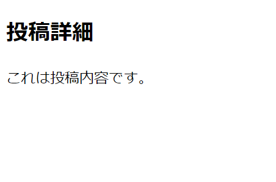
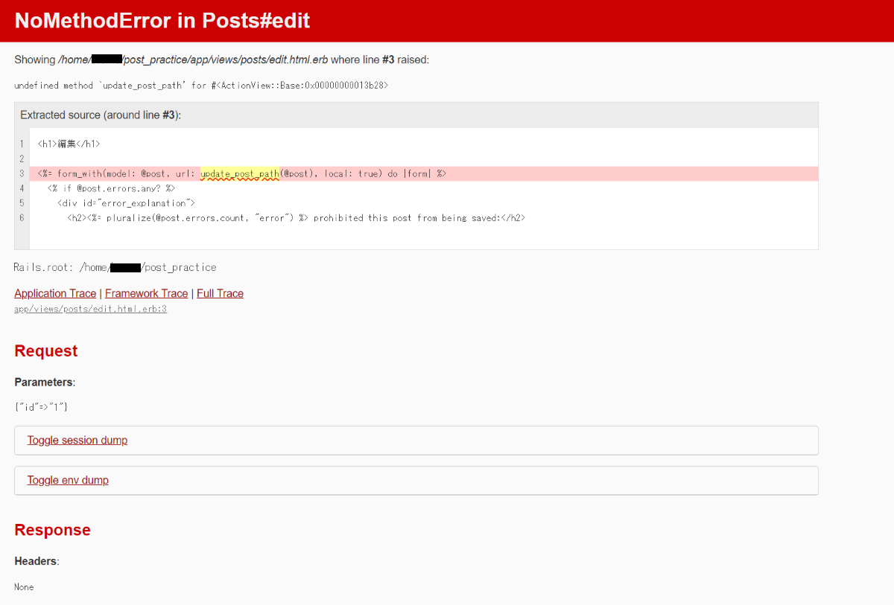
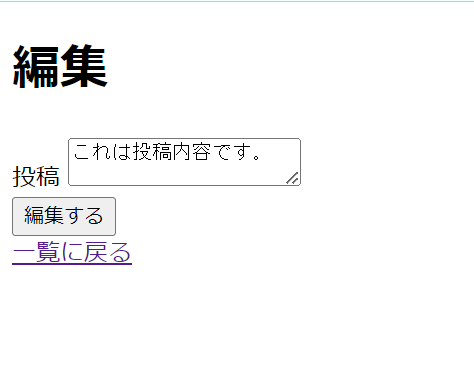
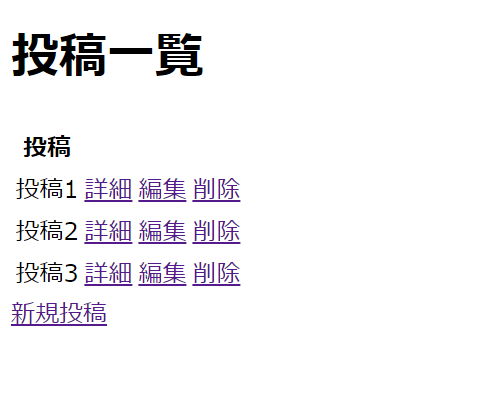
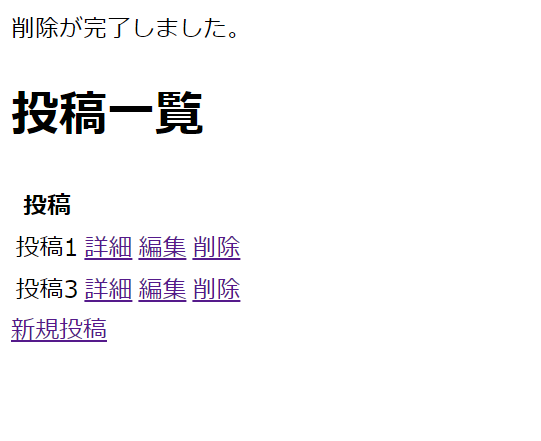

## 8.2 Ruby on Rails：ECサイトの開発 商品一覧3

### 8.2.1 詳細画面への遷移と削除

今回は先ほど作成した`Post`アプリに詳細画面と削除機能を実装します。  
まずは詳細画面を実装していきます。  

ルーティングの設定をしましょう。  
```rb
# config/routes.rb

Rails.application.routes.draw do
  get 'posts/:id', to: 'posts#show', as: 'post' # 追加
  get 'posts/new', to: 'posts#new', as: 'new_post'
  get 'posts', to: 'posts#index'
  get 'posts/:id/edit', to: 'posts#edit', as: 'edit_post'
  post 'posts', to: 'posts#create'
  patch 'posts/:id', to: 'posts#update', as: 'update_post'
end
```

これでルーティングの設定が完了しましたが、次の削除機能にも備えてまとめてしまいましょう。

```rb
# config/routes.rb

Rails.application.routes.draw do
  root 'posts#index'
  resources :posts
end
```

今回はroot_pathを設定しています。root_pathとは、トップページにあたるところを表示します。  
<http://localhost:3000>にアクセスしてみましょう。  
一覧画面が表示されたでしょうか。では、コントローラを設定していきましょう。  

```rb
class PostsController < ApplicationController
  def index
    @posts = Post.all
  end

  def show # 追加
    @post = Post.find(params[:id]) # 追加
  end # 追加
  ・
  ・
end
```

前回に実装したControllerに新たにshowアクションを追加しました。さらに編集します。

```rb
class PostsController < ApplicationController
  before_action :set_post, only: [:show, :edit, :update] # 追加

  def index
    @posts = Post.all
  end

  def show
  end
  ・
  ・
  def edit
  end
  ・
  ・
  def update
    if @post.update(post_params)
      redirect_to posts_path, notice: '編集が完了しました。'
    else
      render :edit
    end
  end

  private
  def set_post # 追加
    @post = Post.find(params[:id]) # 追加
  end # 追加
  ・
  ・
end
```

`before_action`を追加しました。`before_action`はアクションが実行される前に実行されるメソッドです。今回は`:show`と`:edit`、`:update`メソッドの前に実行されます。　　
`private`メソッドにある`set_post`メソッドでは投稿のIDを使用して該当する投稿を取得し、@post インスタンス変数に格納します。共通する動作はメソッドとしてまとめて`before_action`にすることでアクション前に実行したいメソッドはこのようにまとめることができます。  

`show.html.erb`を新規作成しましょう。  
```html
<!-- app/views/posts/show.html.erb -->

<h2>投稿詳細</h2>
<p><%= @post.content %></p>
```

<http://localhost:3000/posts/1>にアクセスしてみましょう。  
IDが1の投稿が存在していれば表示されます。もしエラーが発生してしまった場合は<http://localhost:3000/posts/new>から新規投稿を行うかIDの部分を変更して表示してみましょう。  


次は投稿詳細画面から一覧画面へ遷移するリンクを作りましょう。  
リンクは`link_to`メソッドを使用します。  

```html
<!-- app/views/posts/show.html.erb -->

<h2>投稿詳細</h2>
<p><%= @post.content %></p>
<%= link_to "一覧へ", posts_path %>
```

これで一覧画面へのリンクが作成されました。  
では、ブラウザのデベロッパーツールを表示してみましょう。`<a href="/posts">一覧へ</a>`のようになっています。  
`link_to`はRailsのビューで使用されるヘルパーメソッドであり、HTMLのアンカータグ（`<a>`要素）を生成します。  

リンクを押下して正しく遷移した場合は同様に一覧ページから詳細ページへ遷移するリンクを作成してみましょう。  

  

リンクができた場合は新たに新規投稿をしてみてください。登録された投稿内容の詳細リンクを押下したときに正しく遷移しているか上のアドレスバーから確認しましょう。  

編集リンクを押下してみましょう。以下のようなエラーが発生しています。  


このエラーは`update_post_path`が定義されていないのでエラーが起こります。  
もともとのルーティングの設定では
```rb
# config/routes.rb

patch 'posts/:id', to: 'posts#update', as: 'update_post'
```
としていましたが、現在のルーティングの設定は
```rb
# config/routes.rb

resources :posts
```
に修正しました。そのためパスが変更されアクセスできないようになりました。  
それではルーティングの設定を修正して編集できるようにしてみましょう。



このように表示され、元通りに編集ができれば修正できています。  
一部を修正したときに他の箇所が動作しなくなり、手戻りが発生していまうことがあります。拡張性や柔軟性を考えて、不要な変更を極力避け手戻りを発生させる可能性を低くしながら実装しましょう。  


では、次は削除ボタンを実装していきます。  
ルーティングの設定は完了しているので、Controllerの設定をしていきます。  
```rb
# app/controllers/posts_controller.rb
class PostsController < ApplicationController
  before_action :set_post, only: [:show, :edit, :update, :destroy]
  ・
  ・
  def destroy
    @post.destroy
    redirect_to posts_path, notice: '削除が完了しました。'
  end

  private
  ・
  ・
end
```

`before_action`から取得した`@post`に対して`destroy`メソッドを使用して、データベースからレコードを削除します。  

続いてView側です。今回は一覧ページから削除できるようにしましょう。  
削除ボタンには`link_to`ヘルパーメソッドや`button_to`ヘルパーメソッドを使用してリンクやボタンを生成し、削除アクションが実行されるようにします。  
```html
<!-- app/views/posts/index.html.erb -->
  ・
  ・
  <tbody>
    <% @posts.each do |post| %>
      <tr>
        <td><%= post.content %></td>
        <td><%= link_to '詳細', post_path(post) %></td>
        <td><%= link_to '編集', edit_post_path(post) %></td>
        <td><%= link_to '削除', post_path(post), data: {turbo_method: :delete, turbo_confirm: "本当に削除しますか？"} %></td>　<!-- 追加 -->
      </tr>
    <% end %>
  </tbody>
  ・
  ・
```

ユーザが誤って削除しないように、`data-confirm`属性を使用して削除ボタンを押したときに確認メッセージを表示しています。  

データベースからデータを削除する際には物理削除と論理削除があります。

1. 物理削除：データベースからレコードを完全に削除する方法。
            ※ データベースから削除されたレコードは、永久に失われます。物理削除は、不要なデータをシステムから完全に排除する場合に使用されます。削除されたデータは回復不可能であるため、慎重に使用する必要があります。

2. 論理削除：データベース内のレコードの削除フラグを立てることで、削除をシミュレートする方法。
            ※ 削除フラグを立てたレコードは、データベース内に残りますが、システムによっては通常の検索やクエリの対象から除外されます。論理削除は、削除されたデータの履歴を保持したい場合や、削除したデータを後で復元したい場合に役立ちます。

##### 論理削除の重要性
- 履歴の保持：削除されたデータの履歴を維持
- データの復元：論理削除されたデータはデータベース内に残っているため、後で復元することができる
- データの完全性：データベース内の異なるテーブルにあるデータ間の関連性を維持





選択した投稿が正しく削除されていれば完了です。  

これでCRUD機能の基本的な処理が実装できるようになりました。  
CRUDはデータベースに対して行う基本的な処理で以下の4つの操作を指します。
1. Create(作成)：新しいデータをデータベースに追加します。
2. Read(読み取り)：データベースからデータを取得します。
3. Update (更新)：既存のデータを変更します。
4. Delete (削除)：データベースからデータを削除します。

これらの操作は、データベースを操作するための基本的な機能であり、ほとんどのアプリケーションで必要とされます。  

リクエストと対応するコントローラーアクションでの処理は以下の通りです。

- Create：`POST`リクエストを使用して新しいデータを作成するためのアクション
- Read：`GET`リクエストを使用してデータを表示するためのアクション
- Update：`PATCH`または`PUT`リクエストを使用して既存のデータを更新するためのアクション
- Delete：`DELETE`リクエストを使用してデータを削除するためのアクション

__【問題】__
新たにアプリを作成して、投稿機能を実装してください。  
作成時には以下の条件で実装してください。  
- データベースに保存されるカラムは`タイトル`と`投稿内容`の2種類を実装する
- `rails g model`を使って作成する
- 一覧ページ、詳細ページ、新規作成ページ、編集ページを実装する
- 一覧ページには詳細ページへのリンクを実装する
- 詳細ページへのリンクはタイトルにする
- 詳細ページには編集画面へのリンクと削除ボタン、一覧画面へのリンクを実装する
- 削除ボタンは`button_to`メソッドにする
