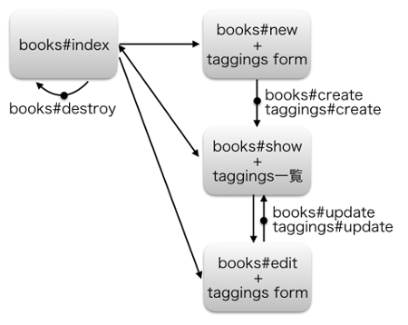

## 8.3 Ruby on Rails：ECサイトの開発 商品一覧4

### 8.3.1 中間テーブルのデータ表示と保存の処理

#### (b) 例題

親テーブルにあたるところで一緒にデータを登録・編集できるようにしていきます。例題として、車のメーカと車種(Type)を考えてみましょう。DB設計の項を参考に、それぞれのテーブルについてCRUDを用意し、Modelにリレーションの設定を追加してください。また、Typeテーブルに車種のデータを2つ以上登録しておいてください。

Maker : 車メーカ テーブル

|field名|名称|型|
|:--|:--|:--|
|name|メーカ名|string|

Type : 車種 テーブル

|field名|名称|型|
|:--|:--|:--|
|name|車種名|string|

MakerType : メーカー車種 テーブル

|field名|名称|型|
|:--|:--|:--|
|maker_id|メーカ名|references|
|type_id|車種名|references|

Makerテーブルの登録・編集で、MakerTypeテーブルも一緒に編集できるようにしていきます。変更箇所は以下の3点です。

##### formへのチェックボックス追加

`collection_check_boxes` は、erbタグ1行だけで必要な数のチェックボックスを並べてくれます。第1引数は参照する親テーブル名、第2引数は中間テーブル名に `_ids` をつけたものを使用します。第3引数以降は通常のチェックボックスと同じですので説明は省略します。

`app/views/makers/_form.html.erb`
```
    <div class="fields">
      <%= form.collection_check_boxes :type_ids, Type.all, :id, :name %>
    </div>
```
この `*_ids` は、ActiveRecordの `collection_singular_ids` と呼ばれるもので、リレーションの関係があるテーブル間で使用できます。例えば、上の例では `Maker.first.type_ids` のように、Typeテーブルのidをまとめて取得することもできます。  

    [*] pry(main)> Maker.first.type_ids
    => [1, 2]

##### Controllerの修正

次はControllerの修正です。フィールドを追加しましたので、ストロングパラメータに追加しておきます。このとき、 `collection_check_boxes` は、チェックボックスの値が配列としてparamsに追加されるので注意してください。中間テーブル用のsaveなどは追加しなくても、type_idsが自動的にデータをcreate/editしてくれます。

`app/controllers/makers_controller.rb`
```
    def maker_params
      params.require(:maker).permit(:name, type_ids: [])
    end
```

##### showへの表示追加

最後に、登録した中間テーブルのデータを表示しましょう。ここではシンプルに車種名を並べておきます。

`app/views/makers/show.html.erb`
```
    <p>
      <strong>タグ</strong>
      <%= @maker.types.map(&:name).join(', ') %>
    </p>
```

#### (c) 問題

以下の図のように、Taggingデータの設定を追加しましょう。




> コラム：全体を俯瞰することとテストについて

> scaffoldで作成したControllerのshowやeditアクションを見ると、中身は何もありませんがきちんと動作します。ご存知のとおり、フィルタと呼ばれる `before_action` で設定しています。（ちなみに、フィルタには `after_action` というものもあります。）また、モデルにはコールバックと呼ばれるものがあります。 `before_save`, `after_save`, `before_create`, `after_create` など、いろいろなタイミングで評価させるものがあります。さらに、Rubyは他のクラスやモジュールを継承しており、例えばRailsのControllerでは `application_controller.rb` を継承して、そこで何か事前に処理をしているときもあります。筆者の経験からも、Controllerの1つのアクションだけを見てその機能を把握することは、ほぼ無理です。
一般の書籍やこのようなテキストでプログラミングを学ぶと、どうしても特定の部分だけを注目しがちです。しかし、普段からRailsがどういうふうに動作しているか全体をイメージしながら実装していくと、思わぬ動作になったときに予測がつけられるようになります。また、テストを書くことによって、そいういった仕様や設計者の意図を伝えることにもなります。そうして、全体を俯瞰したりコードで意思疎通ができるようになることが、上級者の第一歩です。
