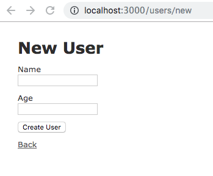

### 8.4 Ruby on Rails: バリデーションとフォームヘルパー


#### 8.4.1 バリデーション(validation:検証)とは

ここでは、ActiveRecordのバリデーション(検証)機能について説明します。
バリデーション機能とはオブジェクトがデータベースに登録される際に、そのデータが正しいものなのかを検証する仕組みです。文字の入力制限や型制限などModel単位で設定することができます。

バリデーションがトリガされるタイミングは、オブジェクトに対して以下のメソッドを使用しデータベースに何らかの変更が行われようとしたときです。下記のメソッドが呼び出されるとデータベースに保存する直前にバリデーションを実行します。バリデーションで何らかのエラーが発生した場合はオブジェクトは保存されません。

- `create`：新しいレコードをデータベースに保存します。バリデーションが失敗した場合、falseを返します。
- `create!`：新しいレコードをデータベースに保存しますが、バリデーションに失敗した場合は例外(通常はActiveRecord::RecordInvalid)を発生させます。
- `save`：レコードの変更をデータベースに保存します。バリデーションが失敗した場合、falseを返します。
- `save!`：レコードの変更をデータベースに保存しますが、バリデーションに失敗した場合は例外(通常はActiveRecord::RecordInvalid)を発生させます。
- `update`：既存のレコードの属性を変更してデータベースに保存します。バリデーションが失敗した場合、falseを返します。
- `update!`：既存のレコードの属性を変更してデータベースに保存しますが、バリデーションに失敗した場合は例外(通常はActiveRecord::RecordInvalid)を発生させます。

__例外とは__  
プログラム実行中に問題が発生したこと

- プログラムが予期しない状況に遭遇した場合に発生
  - データが登録できない
  - ゼロでの除算
  - ファイルが見つからないなど
- 例外はエラーの一種
  - 特定の状況が発生したときに発生(通常はユーザーがプログラムを実行する際に発生)

例外が発生すると、プログラムの通常のフローが中断され、例外を処理するための特別な処理が実行されます。  
→　__例外処理__：例外を捕捉(キャッチ)し、適切な対処を行うための仕組み

プログラムがクラッシュすることなく、エラーに対処し、正常な動作を続行することができます。  
例外処理は通常以下のような形式で記述されます。
```rb
begin
  # 例外が発生する可能性のあるコード
rescue SomeException => e
  # 例外が発生した場合の処理
  puts "An error occurred: #{e.message}"
end
```
`begin`から`rescue`までの間で発生した例外を捕捉し、適切な処理を行います。例外が発生しない場合、`rescue`節はスキップされます。例外を捕捉することで、プログラムの安定性を高め、予期せぬエラーに対処することができます。


__手動でバリデーションをトリガしてみる__  

`valid?`メソッドを使って手動でバリデーションをトリガすることができます。
オブジェクトに対して`valid?`メソッドを使用しバリデーションを実行し、そのオブジェクトにエラーがなければ「`true`」エラーが存在すれば「`false`」を返します。 `invalid`も用意されており`valid?`メソッドの逆の動きをします。

#### 8.4.2 バリデーションを設定してみる

ActiveRecordには、バリデーションヘルパーが多数用意されており、これらのヘルパーは、共通のバリデーションルールを提供します。
実際にModelを用意してバリデーションを設定してみましょう。

__プロジェクトの作成__  

```sh
$ rails new validates_sample
$ cd validates_sample
```

Model:Userを用意します。

`User: ユーザー テーブル`

| field名 | 名 称 | 型 |
|---|---|---|
| id | ID | integer |
| name | 名前 | string |
| age | 年齢 | integer |
| password | パスワード | string |
| email | メールアドレス | string |

__User:MVCを作成__  

後述する `confirmation` へルパーを使用したバリデーションを設定する際、Viewテンプレートへの記述が必要になるので `scaffold` コマンドを使用しています。

```sh
$ rails g scaffold User name:string age:integer password:string email:string
```

 `rails db:migrate` で `users` テーブルを作成しておきましょう。

```sh
$ rails db:migrate
```

__presence__  

このヘルパーは指定された属性が「空ではない」ことを確認します。値が `nil`や空文字(空欄やホワイトスペース)だとエラーが発生しデータベースに保存できません。入力必須項目として設定するという認識でよいでしょう。

フィールド「`name`」「`password`」「`mail_address`」にバリデーションを設定してみましょう。

```rb
# app/models/user.rb

class User < ApplicationRecord
  validates :name, presence: true
  validates :age, presence: true
  validates :password, presence: true
end
```

カンマ(,)で区切ることで同じ行に複数のフィールドを設定することができます。  

__length__  

lengthヘルパーは、値の長さを検証します。多数のオプションが用意されており、何文字以上何文字以下など細かくバリデーションを設定することが可能です。

| オプション | 意味 |
|---|---|
| `minimum:` | 指定した値より小さい値は保存できない |
| `maximum:` | 指定した値より大きい値は保存できない |
| `in:`または`within:` | 指定した値の範囲内でなければならない|
| `is:` | 指定した値と等しい長さでなければならない |

`name`フィールドに、長さ「3文字以上」という制限を追加しましょう。<br>
`age`フィールドには、長さ「3以内」という制限を追加しましょう。<br>
`password`フィールドには、長さ「6文字以上 20文字以内」という制限を追加しましょう。


```rb
# app/models/user.rb

class User < ApplicationRecord
  validates :name, presence: true, length: { in: 3..10 }
  validates :age, presence: true, length: { maximum: 3 }
  validates :password, presence: true, length: { in: 6..20 }
end
```

__numericality__  

`numericality`は、数値のみで構成された値かどうかを検証します。デフォルトでは整数と浮動小数点のみ許可し、符号がある場合も許可します。整数のみ許可したい場合は「`only_integer: true`」を指定します。

`age`フィールドに整数のみ許可するように設定を追加しましょう。

```rb
# app/models/user.rb

class User < ApplicationRecord
  validates :name, presence: true, length: { in: 3..10 }
  validates :age, presence: true, length: { maximum: 3 }, numericality: { only_integer: true }
  validates :password, presence: true, length: { in: 6..20 }
end
```

__uniqueness__  

このヘルパーは、`field`の値が一意(unique)であり重複していないことを検証します。<br>
`name`フィールドと`email`フィールドに一意性を設定しましょう。


```rb
# app/models/user.rb
class User < ApplicationRecord
  validates :name, presence: true, length: { in: 3..10 }, uniqueness: true
  validates :age, presence: true, length: { maximum: 3 }, numericality: { only_integer: true }
  validates :password, presence: true, length: { in: 6..20 }
  validates :email, uniqueness: true
end
```

__confirmation__  

このヘルパーは、2つの受け取った値が完全に一致する必要がある場合に使用します。メールアドレスやパスワードなどで使用します。<br>
このバリデーションヘルパーは仮想の属性を作成します。属性の名前は、確認したい属性名に「_confirmation」を追加したものになります。

`password`に入力確認を設定しましょう。


```rb
# app/models/user.rb

class User < ApplicationRecord
  validates :name, presence: true, length: { in: 3..10 }, uniqueness: true
  validates :age, presence: true, length: { maximum: 3 }, numericality: { only_integer: true }
  validates :password, presence: true, length: { in: 6..20 }, confirmation: true
  validates :password_confirmation, presence: true
  validates :email, uniqueness: true
end
```

Viewテンプレートに「パスワード」と「パスワード入力確認用」のテキストフォームを2つ用意します。<br>
`password_confirmation`にも`presence: true`を指定しているためテキストフィールドに入力しない場合その時点でエラーになります。


```html
<!-- app/views/users/_form.html.erb -->

  <div>
    <%= form.label :password, style: "display: block" %>
    <%= form.text_field :password, type: :password %>
  </div>

  <div>
    <%= form.label :password_confirmation, style: "display: block" %>
    <%= form.text_field :password_confirmation, type: :password %>
  </div>
```

パスワードの入力フォームはオプションを`type: :password`や`<%= form.password_field :password %>`とすることで隠すことができます。  
パスワードはフォームを送信されたときにも暗号化する必要があります。Railsでは`type: :password`などによて基本的に暗号化されるため問題はありませんが、セキュリティ上の懸念がある場合には、さらなるセキュリティ対策を検討することが重要です。  

- パスワードのハッシュ化  
ユーザー登録時のパスワードなどにはセキュリティの都合上はハッシュ化などが行われます。  
ハッシュ化は、パスワードなどの機密情報を安全に保存するために使用されます。ハッシュ関数を使ってランダムな文字列に変換するプロセスです。ハッシュ化された文字列は、元のパスワードを逆にすることができないため、データが盗まれた場合でも元のパスワードを知ることができません。  
Railsでは、通常、`bcrypt`と呼ばれる暗号化ハッシュ関数が使用されます。`bcrypt`は強力な暗号化手法であり、ハッシュ化されたパスワードの保存と認証に広く使用されています。  
これらに関しては後ほど紹介するログイン認証の項目で`devise`という便利で簡単にセキュリティ対策を行えるgemを使いながら詳しく解説していきます。  

__format__  

このヘルパーは、withオプションで指定した正規表現と入力された値がマッチするか検証を行います。

`email`フィールドにフォーマットを設定しましょう。<br>
`:message`オプションを使用しエラーだった場合に表示するメッセージを設定しています。

```rb
# app/models/user.rb

validates :name, presence: true, length: { in: 3..10 }, uniqueness: true
validates :age, presence: true, length: { maximum: 3 }, numericality: { only_integer: true }
validates :password, presence: true, length: { in: 6..20 }, confirmation: true
validates :password_confirmation, presence: true
validates :email, format: { with: /\A[\w+\-.]+@[a-z\d\-.]+\.[a-z]+\z/i,
                            message: "使用できない文字が含まれているか形式に誤りがあります。" }, uniqueness: true
```

#### 8.4.3 バリデーション実行時の動作を確認してみる

先程作成した `Modle:User` を使用して動作を確認してみましょう。<br>
まずコンソールを起動します。

```sh
 $ rails c
```

コンソールからUserオブジェクトを作成し、変数に格納します。

```sh
irb(main) > u = User.new
```

Userオブジェクトが格納された変数uに対して`valid?`メソッドでバリデーションを実行してみましょう。<br>
Userオブジェクトが先ほど設定した制約を満たしていないので`false`が返されます。

```sh
irb(main) > u.valid? # => false
```

__バリデーションエラーの詳細を見る__

先ほどバリデーションエラーとなったUserオブジェクトのエラーの内容を確認してみましょう。
`errors.details`でエラーの詳細を見ることができます。

```sh
irb(main) > u.errors.details
```

```sh
irb(main) > u.errors.details
=> {:name=>[{:error=>:blank}, {:error=>:too_short, :count=>3}], :age=>[{:error=>:blank}, {:error=>:not_a_number, :value=>nil}], :password=>[{:error=>:blank}, {:error=>:too_short, :count=>6}], :password_confirmation=>[{:error=>:blank}], :email=>[{:error=>:invalid, :value=>nil}]}
```

`errors.messages`でエラー時に表示されるメッセージを見ることができます。
`email`に指定したメッセージに設定されていることが確認できます。


```sh
irb(main) > u.errors.messages
```

```sh
irb(main):025:0> u.errors.messages
=> {:name=>["can't be blank", "is too short (minimum is 3 characters)"], :age=>["can't be blank", "is not a number"], :password=>["can't be blank", "is too short (minimum is 6 characters)"], :password_confirmation=>["can't be blank"], :email=>["使用できない文字が含まれているか形式に誤りがあります。"], :attribute=>[]}
```

#### 8.4.4 form_withヘルパーとは

Rails 5.1から`form_for`, `form_tag`の代わりとなる `form_with` ヘルパーが追加されました。これにより `form_for`, `form_tag` ヘルパーは非推奨となりました。
`form_with` ヘルパーは、Viewファイルで簡単にフォームを生成することができるヘルパーです。
まずはプロジェクトを作成し、プログラムがどのようになっているのか確認してみましょう。

```sh
$ rails new form_sample
$ cd form_sample
$ rails g scaffold User name age:integer
$ rails db:migrate
```

コードを確認してみましょう。


```rb
# app/views/users/_form.html.erb

<%= form_with(model: user, local: true) do |form| %>
  <% if user.errors.any? %>
    <div id="error_explanation">
      <h2><%= pluralize(user.errors.count, "error") %> prohibited this user from being saved:</h2>

      <ul>
        <% user.errors.full_messages.each do |message| %>
          <li><%= message %></li>
        <% end %>
      </ul>
    </div>
  <% end %>

  <div class="field">
    <%= form.label :name %>
    <%= form.text_field :name %>
  </div>

  <div class="field">
    <%= form.label :age %>
    <%= form.number_field :age %>
  </div>

  <div class="actions">
    <%= form.submit %>
  </div>
<% end %>
```

`form_with`ヘルパーのブロック引数`form`は、`form_with`ヘルパーで受け取ったモデルの情報を持つFormBuilderオブジェクトです。FormBuilderオブジェクトが知っている`label`メソッドや`text_field`メソッドを使用しフォームを形成します。

`<%= form.label :name %>`でラベルを生成したり`<%= form.text_field :name %>`で、テキストボックスを生成したり、Railsが自動的に渡されたモデルオブジェクト(User)からHTMLを生成してくれているのです。

`form_with`ヘルパーで生成されたフォームから入力された値は、Controllerから`params[:カラム名]`という
形式で取得することができます。例: `params[:name]`, `params[:age]`

`_form.html.erb`によってどのようなHTMLが生成されるのかデベロッパーツールを開いて見てみましょう。

```html
  <form action="/users" accept-charset="UTF-8" method="post"><input type="hidden" name="authenticity_token" value="v/nQIldmxgikiUxiDxQ66PjTHUELCU99tfz2jcmyQ5eNLrLup0aprYlPLCaOM56fP/htHiXoW5lbynU17psWkQ==" />

  <div class="field">
    <label for="user_name">Name</label>
    <input type="text" name="user[name]" id="user_name" />
  </div>

  <div class="field">
    <label for="user_age">Age</label>
    <input type="number" name="user[age]" id="user_age" />
  </div>

  <div class="actions">
    <input type="submit" name="commit" value="Create User" data-disable-with="Create User" />
  </div>
</form>
```

`$ rails s` サーバーを起動し、`http://localhost:3000/users/new` にアクセスしてみましょう。
以下のような画面が表示されているはずです。

```sh
$ rails s
```



#### 8.4.5 form_withヘルパーの使い方

`form_with`ヘルパーにはさまざまなオプションが用意されてます。
`scaffold`コマンドを使用して生成されたファイルには`form_with`ヘルパーに対して`:model`オプションと`:local`オプションが指定されていました。

```html
form_with(model: user, local: true)
```

`:model`オプションは、生成するフォームがどのモデルに基づいて作成されるのかを指定するオプションです。
`model: user`と指定しているので、`UsersController`に`POST`リクエストを送信します。

その他にもさまざまなオプションが用意されています。

| オプション | 概要 | デフォルト値 |
|---|---|---|
| :url | 入力された値を送信する送信先を指定します。 | nil |
| :method | HTTPリクエストを指定します。 | POST |
| :fromat | 送信するデータ形式を指定します。 | text/html |
| :id | id属性を指定します。 | nil |
| :class | class属性を指定します。 | nil |
| :data | data属性を指定します。 | nil |
| :html | id, class, data以外のHTML属性を指定します。 | nil |

他にも複数オプションが用意されています。
ここでは説明しませんが、他にもモデルに基づかないフォームを生成や`form_for`と`form_with`の違いなど調べてみると良いでしょう。


#### 独自のバリデーション作成
バリデーションは独自で作成することができます。  
`validate`メソッドを使用して定義します。  
このように独自で作成したバリデーションはカスタムバリデーションと呼びます。  
以下は簡単な例です。  
```rb
class User < ApplicationRecord
  validate :must_be_adult

  private

  def must_be_adult
    if age.present? && age < 18
      errors.add(:age, "must be an adult")
    end
  end
end
```

以下の手順に従いカスタムバリデーションを作成しましょう。  
1. バリデーションを実装したいモデル内で、validateメソッドを使用してバリデーションを定義します。
2. バリデーションの内容をチェックするための独自のメソッドを作成します。このメソッドでは、条件に応じてerrors.addメソッドを使用してエラーメッセージを追加します。
3. 独自のバリデーションメソッドを必要に応じて呼び出します。通常は、モデルの保存や更新が行われる前に自動的に呼び出されます。


#### 練習  
新たにアプリを作成してバリデーションを追加しましょう。  
そのとき、通常のバリデーションとカスタムバリデーションを両方使用してください。
