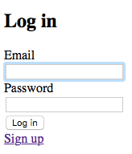

## 9.1 Ruby on Rails：ECサイトの開発 ログイン認証とユーザー管理2

### 9.1.1 例題

認証が必要なマイページを作成します。

ログインするユーザのモデルを作成します。

```
$ rails g devise User
```

作成ができたら、出来上がったモデルを見てみましょう。

`app/models/user.rb`

```
class User < ApplicationRecord
  # Include default devise modules. Others available are:
  # :confirmable, :lockable, :timeoutable, :trackable and :omniauthable
  devise :database_authenticatable, :registerable,
         :recoverable, :rememberable, :validatable
end
```

先ほど説明したDeviseを構成しているモジュールが記載されています。
今回利用するものは下記の4つです。

- Database Authenticatable
- Registerable
- Trackable
- Validatable

上記のものはコメントアウトを外し、
上記のもの以外はコメントアウトしましょう。

`app/models/user.rb`

```
class User < ApplicationRecord
  # Include default devise modules. Others available are:
  # :confirmable, :lockable, :timeoutable, :recoverable, :rememberable and :omniauthable
  devise :database_authenticatable, :registerable,
         :trackable, :validatable
end
```

次にマイグレーションファイルを見てみましょう。

`db/migrate/20170824084617_devise_create_users`

```
class DeviseCreateUsers < ActiveRecord::Migration[5.1]
  def change
    create_table :users do |t|
      ## Database authenticatable
      t.string :email,              null: false, default: ""
      t.string :encrypted_password, null: false, default: ""

      ## Recoverable
      t.string   :reset_password_token
      t.datetime :reset_password_sent_at

      ## Rememberable
      t.datetime :remember_created_at

      ## Trackable
      # t.integer  :sign_in_count, default: 0, null: false
      # t.datetime :current_sign_in_at
      # t.datetime :last_sign_in_at
      # t.string   :current_sign_in_ip
      # t.string   :last_sign_in_ip

      ## Confirmable
      # t.string   :confirmation_token
      # t.datetime :confirmed_at
      # t.datetime :confirmation_sent_at
      # t.string   :unconfirmed_email # Only if using reconfirmable

      ## Lockable
      # t.integer  :failed_attempts, default: 0, null: false # Only if lock strategy is :failed_attempts
      # t.string   :unlock_token # Only if unlock strategy is :email or :both
      # t.datetime :locked_at


      t.timestamps null: false
    end

    add_index :users, :email,                unique: true
    add_index :users, :reset_password_token, unique: true
    # add_index :users, :confirmation_token,   unique: true
    # add_index :users, :unlock_token,         unique: true
  end
end

```

利用するモジュールに必要なカラムが記載されています。<br>
今回利用する4つのモジュールに必要なカラムはコメントアウトを外し、
それ以外のカラムはコメントアウトしましょう。

`db/migrate/20170824084617_devise_create_users`

```
...
    create_table :users do |t|
      ## Database authenticatable
      t.string :email,              null: false, default: ""
      t.string :encrypted_password, null: false, default: ""

      ## Recoverable
      # t.string   :reset_password_token
      # t.datetime :reset_password_sent_at

      ## Rememberable
      # t.datetime :remember_created_at

      ## Trackable
      t.integer  :sign_in_count, default: 0, null: false
      t.datetime :current_sign_in_at
      t.datetime :last_sign_in_at
      t.string   :current_sign_in_ip
      t.string   :last_sign_in_ip

      ## Confirmable
      # t.string   :confirmation_token
      # t.datetime :confirmed_at
      # t.datetime :confirmation_sent_at
      # t.string   :unconfirmed_email # Only if using reconfirmable

      ## Lockable
      # t.integer  :failed_attempts, default: 0, null: false # Only if lock strategy is :failed_attempts
      # t.string   :unlock_token # Only if unlock strategy is :email or :both
      # t.datetime :locked_at
...
```

そのあと、マイグレーションを実行しましょう

```
$ rails db:migrate
```


#### マイページの作成

まずはマイページを作って表示できるようにしてみましょう。
マイページ用のルーティングを追加します。

`config/routes.rb`

```
get :mypage, to: 'mypage#index'
```

次にマイページ用のコントローラーを作成します。

```
$ rails generate controller mypage
```

作成されたコントローラーに下記を追記します。

`app/controllers/mypage_controller.rb `

```
class MypageController < ApplicationController
  def index
  end
end
```

app/views/mypageフォルダの中にindex.html.erbファイルを作成し、下記を追記します。

`app/views/mypage/index.html.erb`

```
<h1>マイページ</h1>
<p>ここはマイページです</p>
```

ここまでできたらサーバを起動して確認してみましょう。

`rails s`でサーバを起動して、`http://localhost:3000/mypage` にアクセスすると、下記のような画面が表示されます。


しかし、この状態だとログインしていない人でもアクセスできてしまいます。
次にこのページに認証をかけて、ログインした人だけがアクセスできるようにします。
認証をかけるには`before_action :authenticate_user!`を使います。

`app/controllers/mypage_controller.rb`

```
class MypageController < ApplicationController
  before_action :authenticate_user!

  ...
end
```

これでマイページに認証がかかりました。早速アクセスしてみましょう。



先ほどとは違って、ログイン画面が表示されたかと思います。


次にログインするためのユーザを作成します。
先ほど表示したログイン画面に`sign up`というリンクがあるのでクリックしてみましょう。

ここでEmail, Password, Password confirmationを入力することでユーザが作成できます。

デフォルトではユーザを作成したら、ログインした状態になります。

早速マイページにアクセスしてみましょう。


今度はマイページが表示されました。

Deviseを使えば、簡単にログイン機能が実装できます。


#### ログアウトの実装

まずはルーティングを確認してみましょう

```
$ rails routes
```

```
destroy_user_session DELETE /users/sign_out(.:format)      devise/sessions#destroy
```

delete destroy_user_sessionというルーティングがあります。
Deviseのログインはsessionを作成、ログアウトはsessionを破棄という表現ができます。
delete destroy_user_sessionのルーティングを使ってログアウトします。

マイページのviewにログアウト用のリンクを追加してみましょう

`app/views/mypage/index.html.erb`

```
<h1>マイページ</h1>
<p>マイページ<p>
<p><%= link_to 'ログアウト', destroy_user_session_path, method: :delete %></p>
```

マイページにアクセスすると、ログアウトのリンクが表示されます。
クリックしてログアウトしてみましょう。

Railsの初期画面が表示されました。
これでログアウトができています。

試しにもう一度マイページにアクセスしてみましょう。
ログイン画面が表示されるはずです。
