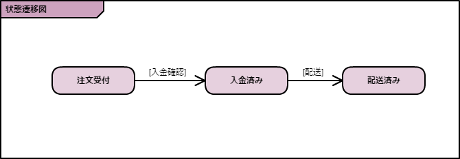

## 11.4 Ruby on Rails：ECサイトの開発 enum/状態遷移1

ここでは、状態遷移と`ActiveRecord::Enum`の機能について説明していきます。

### 11.4.1 状態遷移とは
状態遷移とは、ある状態から特定のイベントで別の状態に切り替わることをいいます。 

身近なところで例える信号を思い浮かべてください。  
信号は「青・黄・赤」の3つの状態を持っています。特定のイベント(時間の経過や押しボタンなど)によってこれらの状態が変化します。青信号は時間が経過すると黄信号に変わり、さらに時間が経過すると赤信号に変わります。このように、信号は異なる状態を遷移します。



上の図は、ECサイトでの注文ステータスの遷移を表した簡単な図になります。
`注文受付`/`入金済み`/`配送済み`が状態で、`入金確認`/`配送`がイベントになります。

例えば、`注文受付`の状態から`入金確認`というイベントが発生することで、`入金済み`という状態に切り替わっています。

状態遷移を管理する場合、1や2などの数字を直接記述する代わりに`STACK`や`RENTED`などの定数を利用して記述することで意味をつけることができます。その時に列挙型を表す`ActiveRecord::Enum`を利用することができます。

`ActiveRecord::Enum`を利用することで、意味にグループを持たせることができます。
列挙型はプログラミングの可読性を高めるためにとても役に立ちます。言語を問わずプログラミングでは数値はときに意味を持ちます。意味はコメントに記載されることは多いですが、長く運用されている場合はその意味が薄れていきます。

### 11.4.2 例題

#### ① ActiveRecord::Enumの実装

次の例では、`Book`クラスでは本の貸出状態（`status`）をインスタンス変数で持ち、「１」は書庫、「２」は貸出中を表します。

```rb
class Book
  def initialize
    @status = 1 # 「１」は書庫、「２」は貸出中。初期値は「１」
  end

  def status
    case @status
    when 1
      'stack' # 書庫であれば、'stack'
    when 2
      'rented' # 貸出中であれば、'rented'
    end
  end

  def rent!
    @status = 2 # 貸出中にする
  end

  def stack!
    @status = 1 # 書庫に入れる
  end
end
```

予約済を表したい場合はどのようにすればよいでしょうか？予約済を表す数字、対応する文字列、更新するメソッドなど考えることが多いですが、その効果は薄いです。例題では、`ActiveRecord::Enum`を利用して本の貸出状態を実装してみましょう。このモジュールは`enum`メソッドを提供し、状態遷移を簡単に実装することができます。また、ここではRSpecを利用してテストも行うので、`Gemfile`に`'rspec-rails'`と`'factory_bot_rails'`を追加してください。

```sh
$ rails new enum_practice
$ cd enum_practice
$ rails g model Book title:string status:integer
```

貸出状態には貸出中（`rented`）、書庫（`stack`）の2つの状態があるとすると、`book.rb`は次のようになります。

```rb
class Book < ApplicationRecord
  enum status: {rented: 0, stack: 1}
end
```

`Value`は省略できます。省略した場合は0から順番に整数が自動的に割り当てられます。

```rb
class Book < ApplicationRecord
  enum status: [:rented, :stack]
end
```

`ActiveRecord::Enum`で状態遷移を定義することにより、`status`は型がIntegerですがプログラム上では文字列で意味を表現できます。さらに、プレフィックスが`?`のメソッドを提供してくれるので、プログラムの可読性が向上します。

`rails c`で確認してみましょう。

```rb
book = Book.new
book.status = 'rented' # 貸出中

puts book.rented? #=> true
puts book.stack?  #=> false
```

次は`!`のメソッドで変更します。

```rb
book.stack!

puts book.rented? #=> false
puts book.stack?  #=> true
```

このように`Enum`を使用することでコードの可読性が向上し、直感的に操作をすることができます。