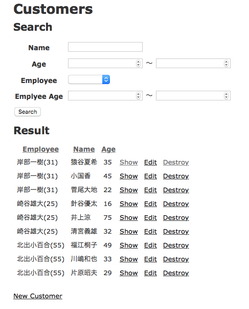

## 13.3 Ruby on Rails：ECサイトの開発 検索2

### 13.3.1 例題
下記のような顧客の検索画面を実装します。



#### scaffoldを使った一覧画面の作成

モデルは下記の2つを準備します。
##### 社員 (Employee)
|項目名|カラム名|型|
|---|---|---|
|名前|name|string|
|年齢|age|integer|

##### 顧客 (Customer)
|項目名|カラム名|型|
|---|---|---|
|担当者|employee_id|integer|
|名前|name|string|
|年齢|age|integer|

Gemfileへの追加とインストールをしましょう

```rb
# Gemfile

gem 'ransack'
```

インストール
```sh
$ bundle install
```

Scaffoldを使って一覧画面を準備しましょう

```sh
$ rails g scaffold employee name age:integer
$ rails g scaffold customer employee:references name:string age:integer
```

generatorで生成されたコードはその時点で一度コミットする癖を付けましょう。

migrateします。

```sh
$ rails db:migrate
```
リレーションの設定を行います。

```rb
# app/models/employee.rb

class Employee < ApplicationRecord
  has_many :customers # 追加
end
```

次にサンプルデータを登録します。

db/seeds.rbに下記コードを追記しましょう

```rb
# db/seeds.rb

employee1 = Employee.create(name: '岸部一樹', age: 31)
employee2 = Employee.create(name: '崎谷雄大', age: 25)
employee3 = Employee.create(name: '北出小百合', age: 55)

employee1.customers.create(name: '猿谷夏希', age: 35)
employee1.customers.create(name: '小国香', age: 45)
employee1.customers.create(name: '菅尾大地', age: 22)
employee2.customers.create(name: '針谷優太', age: 16)
employee2.customers.create(name: '井上涼', age: 75)
employee2.customers.create(name: '清宮義雄', age: 32)
employee3.customers.create(name: '福江桐子', age: 49)
employee3.customers.create(name: '川嶋和也', age: 33)
employee3.customers.create(name: '片原昭夫', age: 29)
```

サンプルデータを登録します。

```sh
$ rails db:seed
```

`app/models/customer.rb`はscaffoldでreferencesを指定したので自動生成されています。

#### 検索フォームの作成
ここでは、顧客の検索をつくるので`app/views/customers/index.html.erb`に検索フォームを追加します。(1)

また、検索結果をわかりやすくるために、担当者（Employee）の名前と年齢が表示されるようにしましょう。(2)

```html
<!-- app/views/customers/index.html.erb -->

<p id="notice"><%= notice %></p>

<h1>Customers</h1>

<% # 修正(1) 検索フォーム ここから %>
<h2>Search</h2>
<%= search_form_for @q do |f| %>
  <table>
    <tr>
      <th>Name</th>
      <td><%= f.text_field :name_cont %></td>
    </tr>
    <tr>
      <th>Age</th>
      <td><%= f.number_field :age_gteq %> 〜 <%= f.number_field :age_lteq %></td>
    </tr>
    <tr>
      <th>Employee</th>
      <td><%= f.collection_select :employee_id_eq, Employee.all, :id, :name, include_blank: true %></td>
    </tr>
    <tr>
      <th>Emplyee Age</th>
      <td><%= f.number_field :employee_age_gteq %> 〜 <%= f.number_field :employee_age_lteq %></td>
    </tr>
  </table>
  <%= f.submit %>
<% end %>
<h2>Result</h2>
<% # 修正(1) 検索フォーム ここまで追加 %>
<table>
  <thead>
    <tr>
      <th>Employee</th>
      <th>Name</th>
      <th>Age</th>
      <th colspan="3"></th>
    </tr>
  </thead>

  <tbody>
    <% @customers.each do |customer| %>
      <tr>
        <% # 修正(2) 担当者の名前に(年齢)を追加 %>
        <td><%= customer.employee.name %>(<%= customer.employee.age %>)</td>
        <td><%= customer.name %></td>
        <td><%= customer.age %></td>
        <td><%= link_to 'Show', customer %></td>
        <td><%= link_to 'Edit', edit_customer_path(customer) %></td>
        <td><%= link_to 'Destroy', customer, method: :delete, data: { confirm: 'Are you sure?' } %></td>
      </tr>
    <% end %>
  </tbody>
</table>

<br>

<%= link_to 'New Customer', new_customer_path %>
```

検索フォームを作成するには`ransack`が提供するViewHelperの`search_form_for`を利用します。
引数には`Ransack::Search`オブジェクトを渡します。

それぞれの入力欄は`form_for`と同様に`#text_field`や`#number_field`を利用します。
これらのメソッドに渡す第一引数によって、どのカラムからどのような条件で検索するかが決まります。

例えば`f.text_field :name_cont`の場合 nameというカラムに入力した内容が含まれているという条件になります。
他にも下記のような条件が設定できます。

|引数|条件|
|---|---|
|カラム名_cont|入力した内容が含まれる|
|カラム名_start|入力した内容から始まる|
|カラム名_eq|入力した内容と同じ|
|カラム名_gt|入力した内容より大きい|
|カラム名_lt|入力した内容より小さい|
|カラム名_gteq|入力した内容以上|
|カラム名_lteq|入力した内容以下|

`Customer`モデルは`belongs_to :employee`が設定されているのでカラム名を`employee_age`とすることで
担当者の年齢から検索することも可能です。

#### 検索処理の作成

画面で入力した内容を受け取って検索を実行します。

```rb
# app/controllers/customers_controller.rb

  # 変更前
  def index
    @customers = Customer.all
  end
  
  # 変更後
  def index
    @q = Customer.ransack params[:q]
    @customers = @q.result
  end
```

ransack 4.0以降、コントローラでのStrong Parameterに似た仕組みとして、以下のように利用したいattributesを受け付けて、不要なattributesは受け取らないようにするための記述をするようになりました。

```rb
# app/models/customer.rb

  # 追加(画面で検索に利用する項目を列挙します)
  # 検索画面の検索項目として顧客(Customer)のname, age, employee_id(社員の選択肢)が配置されているので、それらを受け付けます。
  def self.ransackable_attributes(auth_object = nil)
    %w[name age employee_id]
  end

  # 追加(今回は、社員(Employee)とリレーションしているので関連を記述します)
  # 検索画面の検索項目として、社員(Employee)のageが配置されているので、employeeを受け付けます。
  # このコードは、顧客(Customer)なので、関連があることだけを記述して、Employeeに関する設定はEmployeeモデルで設定します。
  def self.ransackable_associations(auth_object = nil)
    %w[employee]
  end
```

```rb
# app/models/employee.rb

  # 追加(画面で検索に利用する項目を列挙します)
  # 検索画面の検索項目として、社員(Employee)のageが配置されているので、それを受け付けます。
  def self.ransackable_attributes(auth_object = nil)
    %w[age]
  end
```

ransack 4.0以前の場合は、他の画面のコントローラと同様に、必要な項目だけを受け付けるようにStrong Parameterの仕組みを使って、以下のように記述しましよう。

```rb
# app/controllers/customers_controller.rb

  def index
    @q = Customer.ransack(q_params)
    @customers = @q.result
  end

  private
  def q_params
    # 受け付ける項目を列挙します
    params.require(:q).permit(:name, :age, ......)
  end
```

最初に説明した通り`Customer`モデルに`ransack`メソッドが追加されているので、画面で入力した検索条件を引数にして呼び出します。

`ransack`メソッドは`Ransack::Search`オブジェクトを返します。このオブジェクトはviewで利用するためインスタンス変数にセットしておきます。

また、このオブジェクトに対して`result`メソッドを呼び出すことで検索を実行して結果が取得できます。

`rails s`でサーバを起動して<http://localhost:3000/customers>にアクセスしてみましょう。
検索フォームと検索結果が表示されていると思います。

条件を入力して検索してみましょう。

