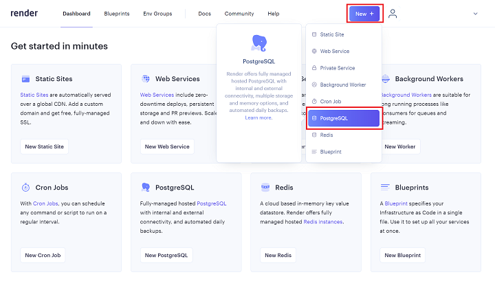

## 14.2 Ruby on Rails：ECサイトの開発 Renderへのデプロイ1

###	14.2.1 Renderについて

アプリケーションを公開するには、サーバーにプログラムファイルを配置し、それにセキュリティなどを考慮して動く状態にする必要があります。これらの作業をデプロイといいます。  
今までのデプロイは、サーバー用のPCを用意し、OSや使用する言語をインストールし、セキュリティーなどの設定を追加し、そのうえでプログラムファイルを設置して動作確認をするという、とても手間がかかるものでした。  
アプリケーションを公開するには、サーバーにプログラムファイルを配置し、それにセキュリティなどを考慮して動く状態にする必要があります。これらの作業をデプロイといいます。
かつてアプリケーションの公開は、サーバー用のPCを用意し、OSや使用する言語をインストールし、セキュリティーなどの設定を追加し、そのうえでプログラムファイルを設置して動作確認をするという、とても手間がかかるものでした。
しかし、近年は、ブラウザから管理画面にログインして表示されるいくつかのボタンをクリックして完了したり、コマンドを数行実行するだけでデプロイができるものが主流になりつつあります。
その中でRenderは、PaaS（Platform as a Service）に分類されるクラウドサービスです。PaaSは、クラウドコンピューティングモデルの一種で、アプリケーションの開発、テスト、デプロイメント、および運用を支援するためのプラットフォームを提供するサービスです。  
利用できるデータベースが1つで、無料期間が90日間という制限付きですが、その制限ないであれば無料で利用できます。

### 14.2.2 Renderへのリリース準備

サインインする方法はいくつか方法がありますが、今回はGitHubのアカウントからサインインしてみましょう。  
下記のURLにアクセスしてください。  
<https://dashboard.render.com/>  
GitHubに登録したメールアドレスが正しければ`COMPLETE SIGN UP`ボタンをクリック。
送られてきたメールにURLのリンクがありますのでアクセスしてください。
必須の選択項目がありますので"Starting a new project"を選択して`CONTINUE TO RENDER`をクリックします。
これでアカウントの作成が完了しました。


では、Renderへのリリースの準備をしましょう。今回は以下の順序で行います。

1. アプリ内のデータベースの設定
2. Renderのデータベースの作成  
3. Renderの本番環境の作成と設定  
4. アプリとデータベースの接続

### 14.2.2.1 アプリ内のデータベースの設定
まずはアプリ内のGemfileとデータベースの設定を変更します。Renderでは、デフォルトのデータベースはPostgreSQLです。
PostgreSQLを使用するためのgemを追加します。

`Gemfile`
```rb
    ruby '2.7.7'
         ・
         ・
    # Use sqlite3 as the database for Active Record
    # gem 'sqlite3', '~> 1.4' #コメントアウト
         ・
         ・
    group :development, :test do
      gem 'sqlite3', '~> 1.4' # 追加
      # Call 'byebug' anywhere in the code to stop execution and get a debugger console
      gem 'byebug', platforms: [:mri, :mingw, :x64_mingw]
    end
         ・
         ・
    group :production do # 追加
      gem 'pg', '~> 1.4' # 追加
    end # 追加
```

Gemfileに"development"、"test"、"production"という単語が出てきましたが、それぞれは以下の通りです。
1. development(開発):コードを書き、新しい機能を追加し、バグを修正する環境。
2. test(テスト):ソフトウェアをさまざまなテスト（単体テスト、結合テスト、機能テストなど）にかけ、バグを見つけて修正する環境。
3. production (本番):ユーザーがソフトウェアにアクセスし、利用する環境。

developmentモードとtestモードではこのままSQLiteを利用しますので、元から存在する`gem 'sqlite3'`はコメントアウトし`group :development, :test do`内へ移動させます。  
`group :production`はデフォルトで書かれていないので追加します。  
Gemfileに追加出来たら以下のコマンドを実行します。
```ターミナル
bundle install --without production
bundle lock --add-platform x86_64-linux
```

`config/database.yml` を開いて、production環境のデータベース指定を変更してください。

```rb
production:
  <<: *default
  database: db/production.sqlite3 #削除
  adapter: postgresql # 追加
  encoding: unicode # 追加
  pool: 5 # 追加
```

### 14.2.2.2 Renderのデータベースの作成
[Render](https://dashboard.render.com/)のダッシュボードにデータベースを追加していきます。
`New+`のボタンをクリックしPostgreSQLを選択しましょう。  
  

画面が変わり次のようなページに遷移します。  
  
NameとRegionを変更していきます。  
Nameは「対象のアプリ名_DB」にするとわかりやすいです。Regionは`Singapore`を選択しましょう。

今回は無料枠を利用しますので、Instance Typeは`Free`にします。  
`Create Database`をクリックしてデータベースを作成します。  
作成が完了するまで少し時間がかかります。  

Dashboardに先ほど作成したデータベースが追加され、STATUSがAvailableになっていればデータベースの作成は完了です。  
先ほど作成したアプリはGitHubにpushし、次の準備をしておきましょう。
次は、Renderの本番環境の作成と設定を行っていきます。
